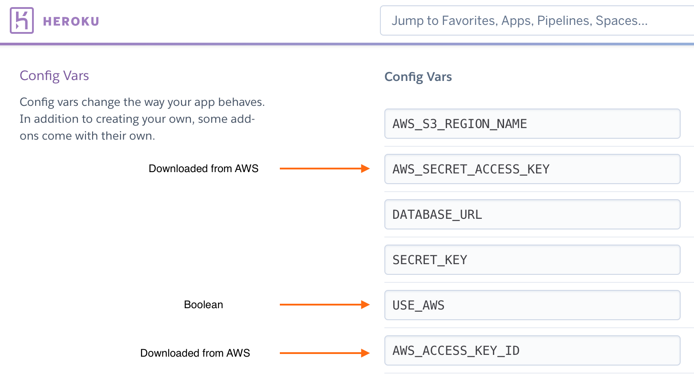

# Hobo & Hatch B2B Ordering Portal

* This ordering portal is created for the fourth and final project on the Full Stack Developer Diploma with Code Institute.  
* The project encompasses the languages and frameworks that I have been using throughout the course, and in particular HTML5, CSS3 & Javascript as frontend tools, using Bootstrap as a frontend framework.  The backend is created with Python, sqlite3 and Django and deployed on Heroku at which point the database used is postgres. 
* The project is based on a real life spec to design a wholesale / B2B ordering portal for retail & wholesale clothing and accessories brand Hobo & Hatch.  The project is delivered at this stage as an MVP, with future features and implementations expected in V2. 

## Strategy
------
* The User stories have been created having discussed in an initial meeting with the brand their requirements for the project.  
* The primary target audience for the brand at a retail / Ecommerce level are women in the 27 to 55 age range with free-spirited values.  They like their own spiritual / bohemian style, and are likely to prefer outdoorsy holidays and hobbies such as surfing and camping and as much travel as possible.  
* This will influence the design in terms of the surface of the website, as even though the website is B2B it is equally important that the brand ethos and look is conveyed to the store buyers. 

## User Stories - Buyer / Stockist
* This group are the primary audience for the site.  Operations need to be simple and effective from browsing through to payment to divert workload from the Brand Owner.  The buyer should be able to easily add styles to the bag, view product details if needed (or not be bombarded with them if they are a repeat purchaser), and edit the bag in a review before proceeding to payment. 

| **US ID** | **User Type**      | **Action**                                               | **Expected Outcome**                                                |
| --------- | ------------------ | -------------------------------------------------------- | ------------------------------------------------------------------- |
|           |                    |                                                          |                                                                     |
| **US 1**  | Buyer / Stockist | View Products                                            | Select items to purchase                                            |
| **US 2**  | Buyer / Stockist | View Products by Category                                | Save time and get to the products I want more easily                |
| **US 3**  | Buyer / Stockist | View Products by Sub Category                            | Further narrow the search for specific purchasing                   |
| **US 4**  | Buyer / Stockist | View Detailed Product info                               | See images, price, description, care info and available sizes       |
| **US 5**  | Buyer / Stockist | See total items and spend in Bag                         | Ensure budget is kept on track                                      |
| **US 6**  | Buyer / Stockist | Select size options easily                               | Easy to order correct items                                         |
| **US 7**  | Buyer / Stockist | Edit or remove items from my bag                         | Easy update of items prior to checkout                              |
| **US 8**  | Buyer / Stockist | Pay securely by card                                     | Checkout securely                                                   |
| **US 9**  | Buyer / Stockist | Use existing Billing / Shipping info or edit at checkout | Ensure the delivery gets to the right place and the card is charged |
| **US 10** | Buyer / Stockist | View more about the brand on an about us page            | Feel confident in the product I am investing in.                    |

## User Stories - Site Owner / Brand Owner
* The Brand / Site owner should have sufficient access to be able to support the client where needed.  They should have full CRUD accessibility and this should not be too technical to access. 

| **US ID** | User Type                | Action                                                 | Expected Outcome                                                                         |
| --------- | ------------------------ | ------------------------------------------------------ | ---------------------------------------------------------------------------------------- |
|           |                          |                                                        |                                                                                          |
| **US 11** | Brand Owner / Site Owner | Create, Read, Update, Delete customer info             | Assist customers with their purchasing & ensure old customer data is not stored too long |
| **US 12** | Brand Owner / Site Owner | Edit customer orders                                   | To change customer order incase of cancelled lines / customer request etc.               |
| **US 13** | Brand Owner / Site Owner | Assign Customer Access Level based on Product Category | Only give purchasing rights to the correct customers                                     |
| **US 14** | Brand Owner / Site Owner | Provide a frequently asked questions page              | To avoid unnecessary inbound customer service emails                                     |
| **US 15** | Brand Owner / Site Owner | Display customer testimonials                          | Encourage new stockists                                                                  |

## User Stories - Site User / First Time User
* As this site is not intended for the general public, the following are intended to cover users that do not know the brannd already or may be trying to log in / register for the first time. 

| **US ID** | User Type | Action                                                    | Expected Outcome                                                    |
| --------- | --------- | --------------------------------------------------------- | ------------------------------------------------------------------- |
|           |           |                                                           |                                                                     |
| **US 16** | Site User | Register for an account                                   | Easily create account                                               |
| **US 17** | Site User | Receive email response to confirm registration request    | Be reassured that your request is being processed                   |
| **US 18** | Site User | Login and Logout                                          | Access shopping, and account info.                                  |
| **US 19** | Site User | Recover Password                                          | Able to easily re-access my account through a link                  |
| **US 20** | Site User | Easily create personalised user profile                   | Be able to view order history and edit account / business details.  |
| **US 21** | Site User | Have a good re-direction experience if not a B2B customer | Be redirected to the E-commerce site and / or social media profiles |

## Scope & Features
------

## Structure
------

### Conceptual Design
* Given that the general premis of the site is centered around B2B ordering, most core features & actions are taken in the logged in status of a B2B stockist.  The below conceptual flowchart is produced on Lucid Chart and gives a visual representation of the key customer journeys whilst using the site. 

### Database Schema
* In the development environment sqlite3 and fixtures will be used to create the relational database.  Then in production to Heroku, postgres will be used. 
* Below you can see the intended database model for this project including anticipated fixtures and forms.  

## Skeleton
------
### Wireframes

* Desktop View

* Mobile View

* Tablet View

## Surface
------
### Design Inspiration & Colour Choices
* Hobo & Hatch HQ is located in Perth, Australia and consequently a lot of their design inspiration comes from the sea, rust-coloured landscape elements and natural tones. 
* Additionally, I wanted to ensure that the colour pallete was in keeping with colour trends, so I took a look at colour trends for 2022 on [Pantone](https://www.pantone.com/articles/fashion-color-trend-report/new-york-fashion-week-spring-summer-2022)
* I found that the following colours were aligned with the colours I was considering that had been inspired by the brand imagery:

* Here are some example images from the brand's lifestyle image collection

* With these inspirations I settled on the following colour scheme produced on [Coolors](https://coolors.co/)

### Typography
* For fonts I will be using Quicksand from [Google Fonts](https://fonts.google.com/?query=quicksand) for the body text as this is an accessibility friendly font, and has a light yet clear effect which is reflective on the brand's values of 'treading lightly'.  
* For titles & headers Montserrat will be used [Google Fonts](https://fonts.google.com/?query=montserrat)
### Imagery
* Imagery used will be source from the brand itself - Hobo & Hatch. 

## Deployment

The deployment of a Full Stack ecommerce store using the Django framework takes multiple different considerations since we are also needing to store and serve multiple different images, take payments and store product and order data. 
To serve the project I am using an AWS S3 bucket to store and serve the static files / images, I am using Heroku to host the site and using the Heroku Postgres add-on as the database. 

### Heroku Set-up

* Create a Heroku app on the [Heroku Website](https://id.heroku.com/login) by clicking on the new app button:

* In the resources tab of the Heroku app, go to the add-ons section and search for postgress. For this app I used the free version 'HobbyDev' : 

* To enable the use of Postrgres, back in Gitpod install dj_database_url,and psycopg2-binary in the CLI.  The CLI commands are:
* pip3 install dj_database_url
* pip3 install psycopg2-binary
Then: 
* pip3 freeze > requirements.txt 
The pip3 command is to save your installation dependencies. 

* In your settings file, add 'import dj_database_url' at the top of the file below the other import instructions. 
* Configure the database in settings file

* Because Postgres is a different database to SQlite3 (which is what is used in the Git environment) it is necessary to make migrations, migrate and re-load the data, in the case of this app using fixtures.  The following commands were used:
* python3 manage.py makemigrations
* python3 manage.py migrate 
* python3 manage.py loaddata for each fixture you want to upload ensuring that you consider dependencies between the fixtures. 
* python3 createsuperuser to create an admin user and follow the instructions in the Git CLI. 
* Create if statement in settings file to ensure that if we are in Heroku we connect to Postgres, and if not to Sqlite3 
Install Gunicorn using:
* pip3 install gunicorn

* Create a Procfile to enable dynos
* Since I am hosting images in an S3 bucket on AWS, it is necessary to instruct Heroku not to pick up the static media files from the Git repository by COLLECT-STATIC -1 in Keroku config vars.
* Set up secret key in eny.py and also in the Heroku environment variables. 
* Set up allowed hosts in settings.py
* Ensure that your env.py is in your Gitignore before pushing changes. 
* Push and merge any changes to main branch if relevant then push again.  
* Login to Heroku through the GIT CLI and git push heroku main to deploy the first verion to Heroku
* In Heroku set up automatic deployments by linking from github - please note on branches that you will need to merge your branch to main in git if your automatic deploys are set up in Heroku. 
* Check it's working by using the Open app button in Heroku.  

### AWS S3 Bucket set-up 
Head across to AWS.amazon.com
create an amazon account 
you will need to add in some payment details, so please be aware that if you go above the free usage limits. 
Once the account is created or if you already have an account you can sign in.
In the main dashboard, If you hace already used S3 buckets you will find in 'Recently Used Services' or otherwise you can search for S3 in the search bar:

Once you have clicked to reach S3, you can click on 'Create Bucket' to create your bucket:

* From here, best practise is to **give your bucket a matching name to your Heroku app name**  
* For region, **select the region closest to you**. 
* You need to **allow pulic access** since the images will be publically viewed - you do this by **un-ticking the 'block all public access' checkbox**, it will look like this which can be a little daunting, but is correct!:

* Then you can click on the 'Create Bucket' as the bottom of the page:

* Once the bucket is created you will be re-directed to your list of buckets.  
* From here further settings need to be put in place. 
Firstly, you will need to **click on the properties tab**:

* From here, scroll down to Static website hosting and for Static webhosting choose **Enable**, Hosting type should be **'Host a Static Website'** 
* You will also need to **add defualt values for index document and error document**.  The settings chosen should resemble the below, then you can click to save changes:

Next up, select the permissions tab:

* It is necessary to add a **Cross-origin resource sharing (CORS)** to enable the domains to interact with one another - This cors JSON format is one I used from the Code Institute lessons, and I pasted it in here like so, then save changes:

* Still in the permissions tab it is necessary to **create a bucket policy** - handly this can be automatically generated by *clicking on Policy Generator:

* Once in the generator you need to select the following options:
* Policy type should be **S3 Bucket Policy**
* Effect should be **Allow**
* Principal should be an '*' to allow all
* Actions should be **Get Object**
* Amazon resource name you can find in the **edit bucket policy tab** and paste it in. 
* Finally you can click add statement:

* Then click **Generate Policy**:

* This will generate a json formatted policy that you then copy and paste into the **Bucket Policy** tab. 
* In the "Resource" row, ensure to add "/*" within the quotes at the end - This is to enable access to all resources in the bucket. 
Then click **save**.
* Still in the permissions tab, **click edit** in the **Access control list (ACL)**
* From here set to **allow public access** and save changes:

### Creating a user for AWS

To use the S3 Bucket, it is necessary to create a user.  

* Back in the AWS Management Console, either **click on IAM** in your recently visited services or serach for the same in the search bar. 

* Create a **user group** for the user by clicking on **User Groups** in the side menu of AWS:

* Then click on **Create Group**

* Give your group a name that is relevant to the project / user
* Click through the following steps to create group ( we come back to those later on )
* Create an **access policy** associated with the relevant S3 bucket by choosing **policies** from the side menu bar:

* Then **click create policy button**
* From the Create Policy page click **import managed policy**

* From the choose policies to import page **search for S3** and select **s3 full access policy** and **click the import button**:

in the JSON tab, on the resources row, you will need to add again the **arn number** that you used previously from the bucket policy page to the json text - in the format of a list with one line including the arn number, and one including the arn number with "/*" at the end. 
* Then you can click **review policy** to add a name and a description. 
* Finally click through to **create policy**
* Then back in **User Groups** click on your newly created group
* Search for the **policy** you created and click **Attach Policy**
* Next **Create a User** to add to the group by navigating to the **Users** page:

* Click **add user** and give the user a name that makes sense to your project and user access and select the **Programmatic Access** radio button and click **Next** 
* From this page you can tick the appropriate group and click **Next** until the final **Create User** button.  
* A CSV will be created with the user access details - **download this and save it in a safe place** These details can only be downloaded once. 

### Connecting AWS to Django 

* To be able to use crud functionality to create, update and delete static files in AWS through the django UI it is necessary to install boto3 usign the following command:
* pip3 install boto3
* I also installed  which is a collection of storage backends for Django, using the command:
* pip3 install django-storages
* followed by pip3 freeze > requirements.txt to ensure the dependencies are installed in deployment.
* next add 'storages' to installed apps in settings.py:

* Define access variables and media storage config in the settings.py file being sure to keep any secret keys either in your env.py file or in the environment variables on GIT. 

* Set up the same variables in the Heroku config vars.
* Create a custom storages file, importing ettings and S3Boto3Storage. with classes inheriting S3Boto3Storage and defining location for static files and media files. 

* Remove the Collect Static Config var to enable the static files to be collected into the buid on the next push.
* If the build has been successful, you should see a similar output to this in the Heroku build log:

* You should then also be able to see your static folder in your S3 bucket

#### DEPLOYMENT ISSUES 
I decided to deploy early so as not to get nasty surprises close to the due date of the project - I came up against a few issues and I thought it would be useful to document these here.  
* The first error I encountered on this process was "Django.db.utiles.DataError: value to long for type"
upon which I entered the command to see if there were outstanding migrations:
* python3 manage.py showmigrations
This revealed that indeed there were quite a few migrations that had not applied. 

I searched on slack to see if anyone had encountered a similar problem, and discovered that you can skip the offending migration using:
* python3 manage.py migrate app_name migration_name --fake
So I decided to try this and the remaining migrations processed. However another error was thrown: 
 
After running through where the process may have gone wrong and with my mentor and finding no obvious methodology errors, we decided to remove the migrations - and with help from tutor support re-install them and re-running all the migrations. 

## Bugs & Fixes

* Filtering checkbox choices:

Part of the **US 2** is to be able to view the products by Categroy, which I had chosen to deliver as a checkbox of options on the collections page.  For some time I was unable to get the products to filter appropriately ( no filtering was occuring, despite query logic in the view )

In the end I managed to solve this by combining solutions from these two Stack overflow posts:

