# Hobo & Hatch B2B Ordering Portal

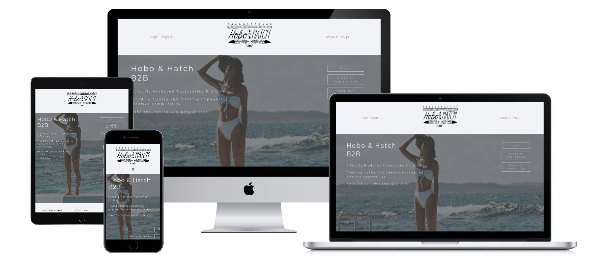

* This ordering portal is created for the fourth and final project on the Full Stack Developer Diploma with Code Institute.  
* The project encompasses the languages and frameworks that I have been using throughout the course, and in particular HTML5, CSS3 & JavaScript as front-end tools, using Bootstrap as a front-end framework.  The back-end is created with Python, sqlite3 and Django and deployed on Heroku at which point the database used is Postures. 
* The project is based on a real life spec to design a wholesale / B2B ordering portal for retail & wholesale clothing and accessories brand Hobo & Hatch.  The project is delivered at this stage as an MVP, with future features and implementations expected in V2. 

## Strategy
------
* The User stories have been created having discussed in an initial meeting with the brand their requirements for the project.  
* The primary target audience for the brand at a retail / E-commerce level are women in the 27 to 55 age range with free-spirited values.  They like their own spiritual / Bohemian style, and are likely to prefer outdoorsy holidays and hobbies such as surfing and camping and as much travel as possible.  
* This will influence the design in terms of the surface of the website, as even though the website is B2B it is equally important that the brand ethos and look is conveyed to the store buyers. 

## User Stories - Buyer / Stockist
* This group is the primary audience for the site.  Operations need to be simple and effective from browsing through to payment to divert workload from the Brand Owner.  The buyer should be able to easily add styles to the bag, view product details if needed (or not be bombarded with them if they are a repeat purchaser), and edit the bag in a review before proceeding to payment. 

| **US ID** | **User Type** | **Action** | **Expected Outcome** |
| --------- | ------------------ | -------------------------------------------------------- | ------------------------------------------------------------------- |
| | | | |
| **US 1** | Buyer / Stockist | View Products | Select items to purchase |
| **US 2** | Buyer / Stockist | View Products by Category | Save time and get to the products I want more easily |
| **US 3** | Buyer / Stockist | View Products by Sub Category | Further narrow the search for specific purchasing |
| **US 4** | Buyer / Stockist | View Detailed Product info | See images, price, description, care info and available sizes |
| **US 5** | Buyer / Stockist | See total items and spend in Bag | Ensure budget is kept on track |
| **US 6** | Buyer / Stockist | Select size options easily | Easy to order correct items |
| **US 7** | Buyer / Stockist | Edit or remove items from my bag | Easy update of items prior to checkout |
| **US 8** | Buyer / Stockist | Pay securely by card | Checkout securely |
| **US 9** | Buyer / Stockist | Use existing Billing / Shipping info or edit at checkout | Ensure the delivery gets to the right place and the card is charged |
| **US 10** | Buyer / Stockist | View more about the brand on an about us page | Feel confident in the product I am investing in.  |

## User Stories - Site Owner / Brand Owner
* The Brand / Site owner should have sufficient access to be able to support the client where needed.  They should have full CRUD accessibility and this should not be too technical to access. 

| **US ID** | User Type | Action | Expected Outcome |
| --------- | ------------------------ | ------------------------------------------------------ | ---------------------------------------------------------------------------------------- |
| | | | |
| **US 11** | Brand Owner / Site Owner | Create, Read, Update, Delete customer info | Assist customers with their purchasing & ensure old customer data is not stored too long |
| **US 12** | Brand Owner / Site Owner | Edit customer orders | To change customer order in case of cancelled lines / customer request etc. |
| **US 13** | Brand Owner / Site Owner | Assign Customer Access Level based on Product Category | Only give purchasing rights to the correct customers |
| **US 14** | Brand Owner / Site Owner | Provide a frequently asked questions page | To avoid unnecessary inbound customer service emails |
| **US 15** | Brand Owner / Site Owner | Display customer testimonials | Encourage new stockists |

## User Stories - Site User / First Time User
* As this site is not intended for the public, the following are intended to cover users that do not know the brand already or may be trying to log in / register for the first time. 

| **US ID** | User Type | Action | Expected Outcome |
| --------- | --------- | --------------------------------------------------------- | ------------------------------------------------------------------- |
| | | | |
| **US 16** | Site User | Register for an account | Easily create account |
| **US 17** | Site User | Receive email response to confirm registration request | Be reassured that your request is being processed |
| **US 18** | Site User | Login and Logout | Access shopping, and account info.  |
| **US 19** | Site User | Recover Password | Able to easily re-access my account through a link |
| **US 20** | Site User | Easily create personalized user profile | Be able to view order history and edit account / business details.  |
| **US 21** | Site User | Have a good re-direction experience if not a B2B customer | Be redirected to the E-commerce site and / or social media profiles |

## Scope & Features
------

## Structure
------

### Conceptual Design
* Given that the general premise of the site is centered around B2B ordering, most core features & actions are taken in the logged in status of a B2B stockist.  The below conceptual flowchart is produced on Lucid Chart and gives a visual representation of the key customer journeys whilst using the site. 
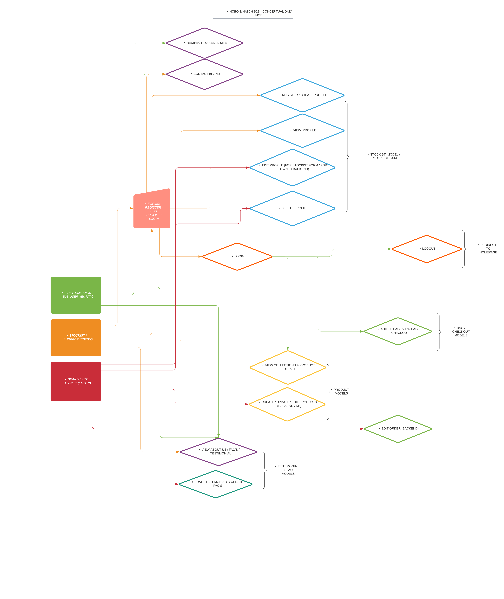

### Database Schema

* In the development environment sqlite3 and fixtures will be used to create the relational database.  Then in production to Heroku, postures will be used. 
* Below you can see the intended database model for this project including anticipated fixtures and forms.
 
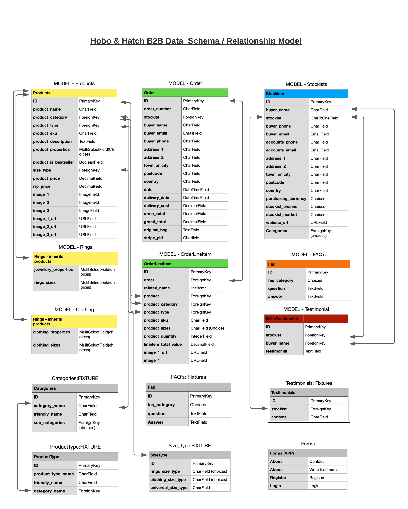

## Skeleton
------

### Wire frames

* Desktop View

* Mobile View

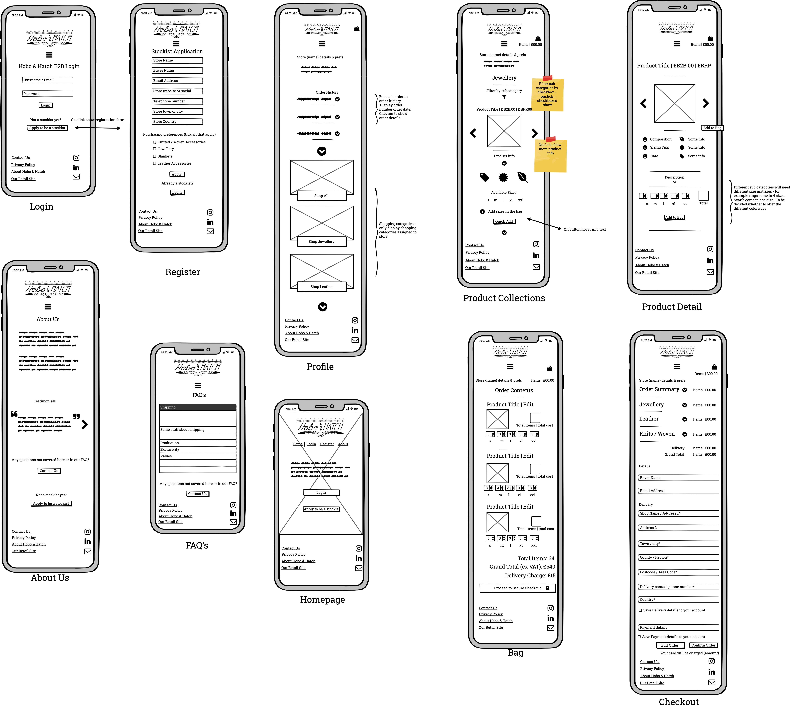

* Tablet View

## Surface
------

### Design Inspiration & Colour Choices
* Hobo & Hatch HQ is located in Perth, Australia and consequently a lot of their design inspiration comes from the sea, rust-coloured landscape elements and natural tones. 
* Additionally, I wanted to ensure that the colour palette was in keeping with colour trends, so I took a look at colour trends for 2022 on [Pantone](https://www.pantone.com/articles/fashion-color-trend-report/new-york-fashion-week-spring-summer-2022)
* I found that the following colors were aligned with the colors I was considering that had been inspired by the brand imagery:

* Here are some example images from the brand's lifestyle image collection

* With these inspirations I settled on the following colour scheme produced on [Coolors](https://coolors.co/)
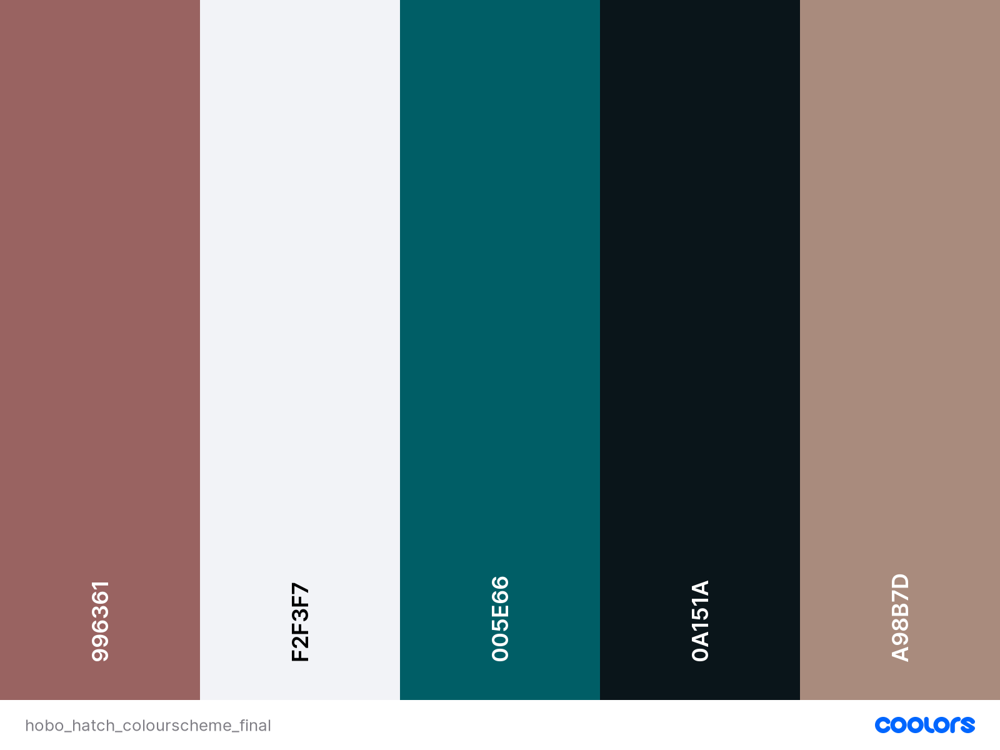

### Typography
* For fonts I will be using Quicksand from [Google Fonts](https://fonts.google.com/?query=quicksand) for the body text as this is an accessibility friendly font, and has a light yet clear effect which is reflective on the brand's values of 'treading lightly'.  
* For titles & headers Montserrat will be used [Google Fonts](https://fonts.google.com/?query=montserrat)

### Imagery
* Imagery used will be sourced from the brand itself - [Hobo & Hatch](https://www.hoboandhatch.co.uk/)

## Project Management / Timekeeping

* I used [GitHub Projects](https://docs.github.com/en/issues/trying-out-the-new-projects-experience/about-projects) to keep track of tasks that need completing as part of this Full Stack E-commerce project.  You can view the live project board [here](https://github.com/GJSayers/hobo-hatch-b2b/projects/1)

* Here is an example of the board in full swing part way through the project, I used the issues features to track bugs and fixes

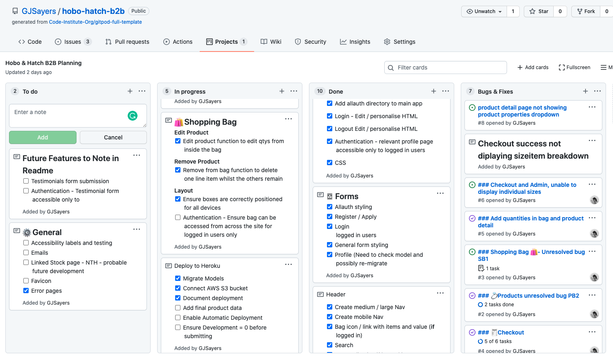

## Version Control 

* [Git pod](https://gitpod.io/) Was used for version control, with branched being used for each separate set of apps with closely related functionality - This enabled me to safely develop on the branches and then merge into the main branch when a certain feature or fix had been tested on it's branch.  At the later stages some work was carried out directly on main, and I also created simply a 'dev' branch to ensure there were not too many conflicts to deal with at crucial last stages of the project.

## Features

### Homepage

* For the Homepage of Hobo & Hatch B2B it was essential for the potential or existing customer to get a sense of the brand on first site and a simple to navigate set of call to actions base on whether the customer is a new user, a registered user or completed profile user, so I used one of the brand's autumn-winter season photos as the main backdrop with a colour filter overlay to ensure text is accessible.

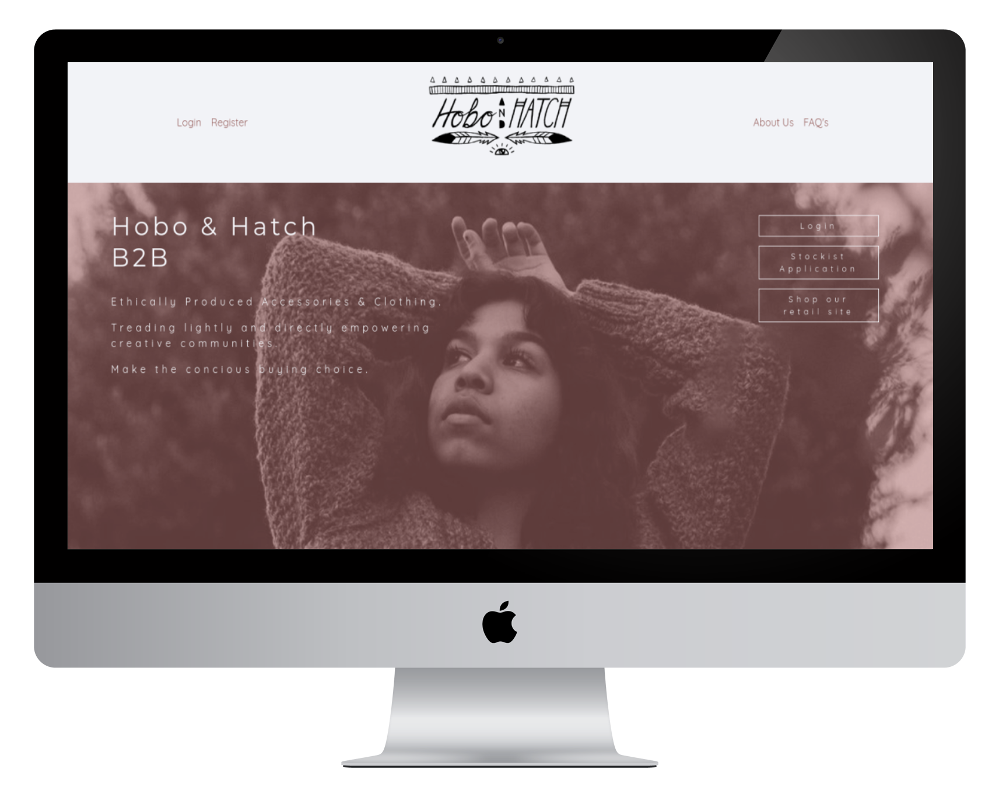

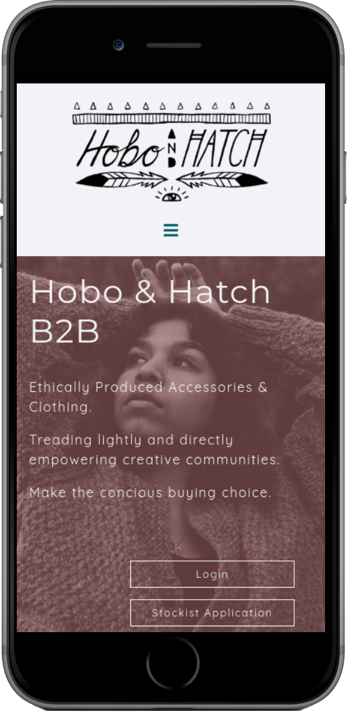

### Navigation
 
* For the Navigation, due to the level of permissions required for a B2B Site it is also necessary to ensure that the links to not lead to any non-permitted pages

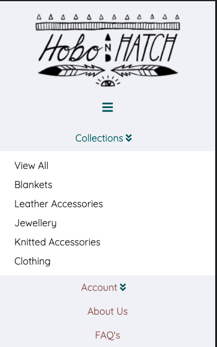

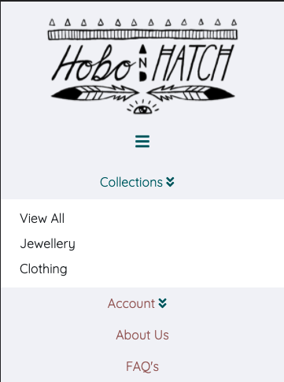

### Profile, Authentication & Permission Process for a B2B site

* A B2B site operates a little differently from a standard E-commerce site, in that purchases can only happen once the Profile is set-up not only by the user having registered, but also approved by admin.  This is due to the B2B business needing to ensure that they have all relevant details needed for business supply and analysis.  This means that there is a three step process involved:
 1) Customer registers as a user 
 2) Customer is redirected to fill in a more detailed profile form and submits this(and receives a message in the window to let them know their account application will be reviewed)
 3) Admin user selects the relevant Category permissions in the back-end & contacts the customer to alert them that they can now begin to place orders. From this point the profile user has access to their assigned/ permitted categories and this is reflected across the site.

### Profile Page - Newly approved stockist

### Profile Page - Populated

* Once the profile page is populated, it contains both the order history and the customer details, as well as a form to update the profile field which are not exclusive to the admin user.

* You can see in the screenshots that the categories tabs are populated by the permitted categories and the user gets a personalized experience by being greeted in their account with their name:

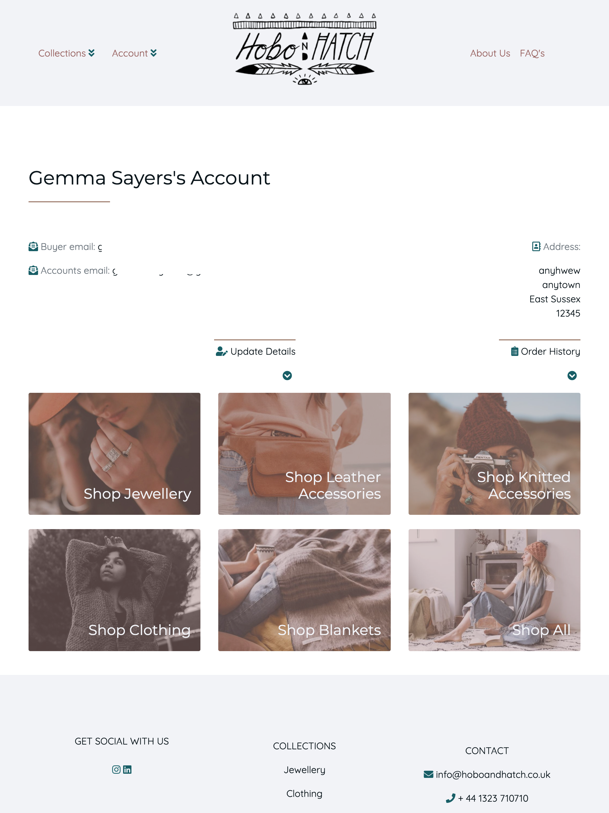

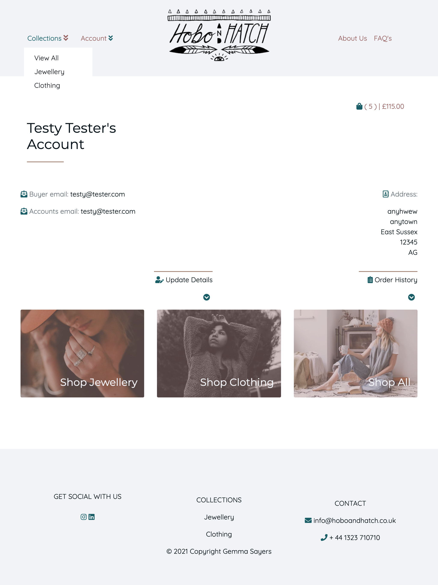

* From the **Profile Page** You can also **update your details** which are refilled with existing data where relevant, and **order history** - both features are hidden until requested by clicking on the green chevron circle:

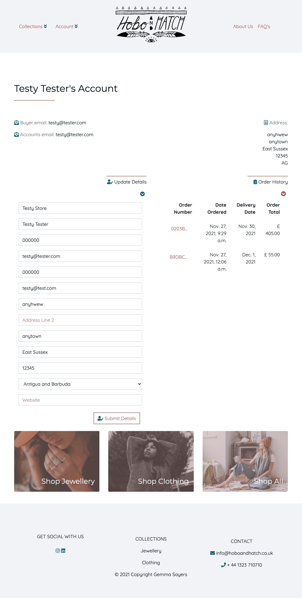

### Collections

* The collections consist of currently 5 different categories, and there is scope to increase this in the back-end.  The product listings are delivered using bootstrap cards to keep a uniform appearance, and because the brand has differing size images, I have used `object-fit: vh` rules in the CSS so the products can sit next to each other and still be pleasing to the eye.

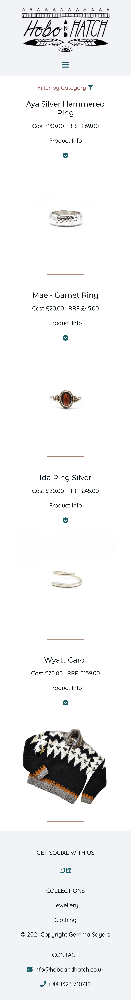

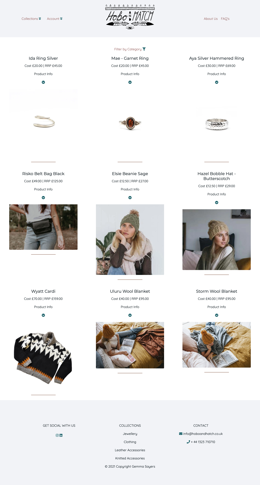

### Filtering 

* From the collections page the products can be filtered by one or more Categories using the checkbox filter feature - This is a permissions-based feature linking back to the assigned categories

### Product Detail

* The products detail also uses cards, and included a detailed description of the product as well as multiple size inputs & product info drop down 

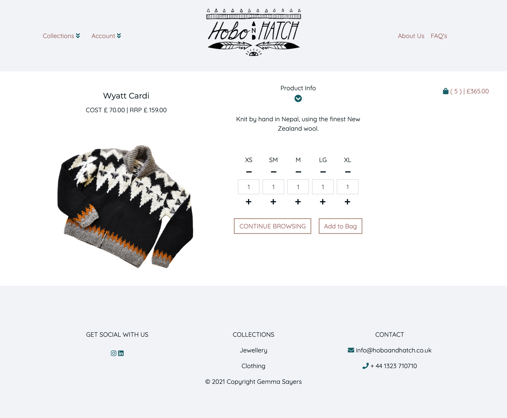

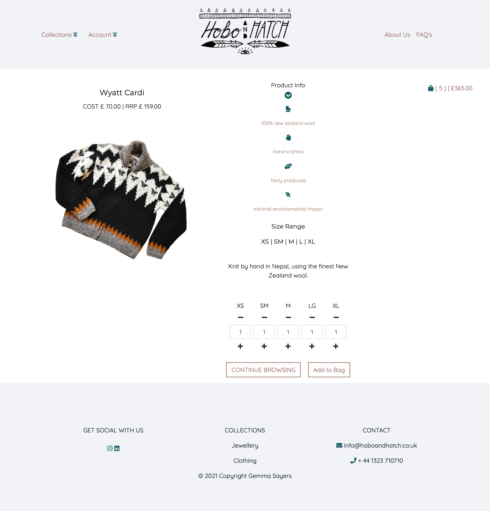

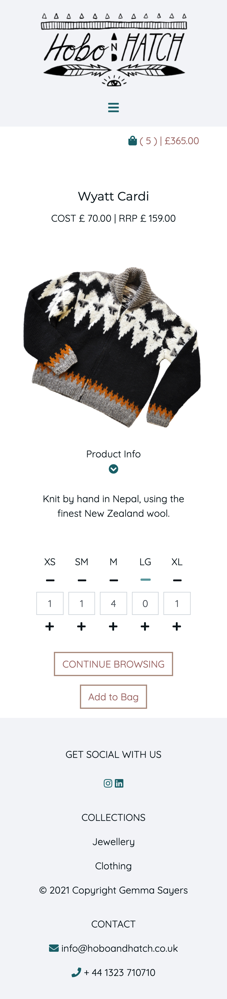

#### **Interactive Product Info Feature**

* To display the product info without the option to hide it makes for a busy page, so I decided that a drop down functionality was necessary so that buyers can access the product details at a glance - This feature is operational on both the Product detail and collections pages.  The data for the info sections is populated by the data held in the Product Model, and an icon is added depending on which info item is relevant.

#### **Multiple Sizing Entry**

* Since B2B customers have to consider the size ratio as a whole, it was necessary to be able to add multiple sizes in one product submission - This took a great deal of trial and error to perfect, but the result has great UX!  The code for this is also fairly easily scalable, so there is potential to add different options in the future should the brand require.

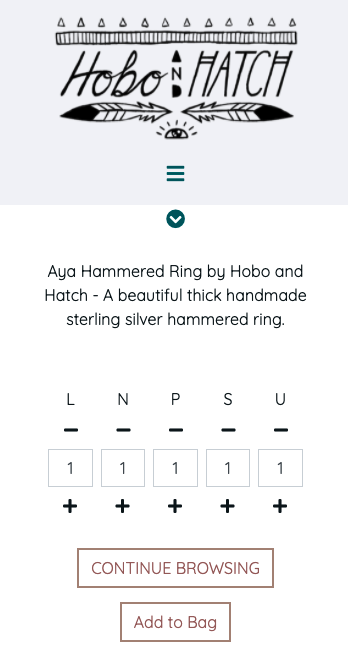

### Multiple Sizing Entry in Admin

* In order to successfully edit an order / line item in the admin it was necessary to apply a similar logic to the sizing inputs - An admin user can easily update all different types of products and their size breakdowns in the admin

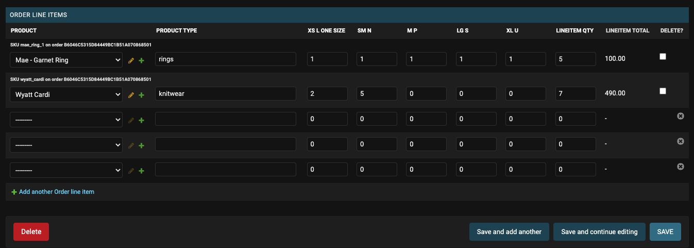

### Bag

* The bag contains a great deal of information due to the multiple sizes per item and the potential multiple items a professional buyer would be adding to the bag - It took quite a lot of refactoring to get to the final version of the bag, which is fully responsive and with the option to edit the sizes or remove the items. 

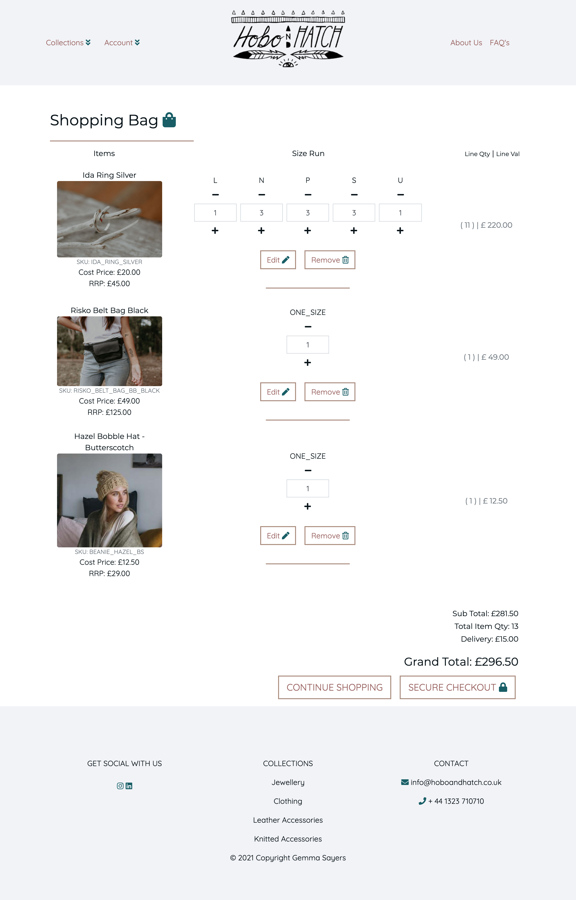

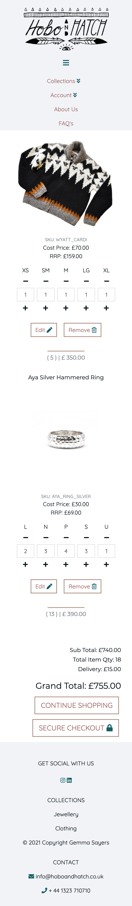

### Checkout with Stripe

* The checkout provided is using the Stripe API with styling from crispy-forms.  The user has an easy to use form and can update their profile details on checkout should they choose to do so

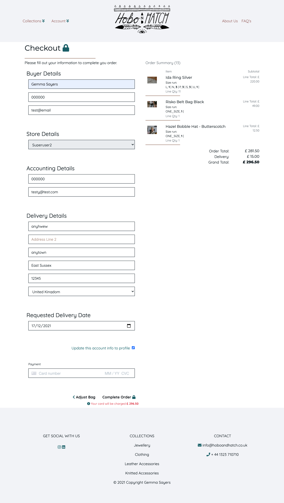

* The checkout success fires an email to the given email address and returns a summary of the order placed. 

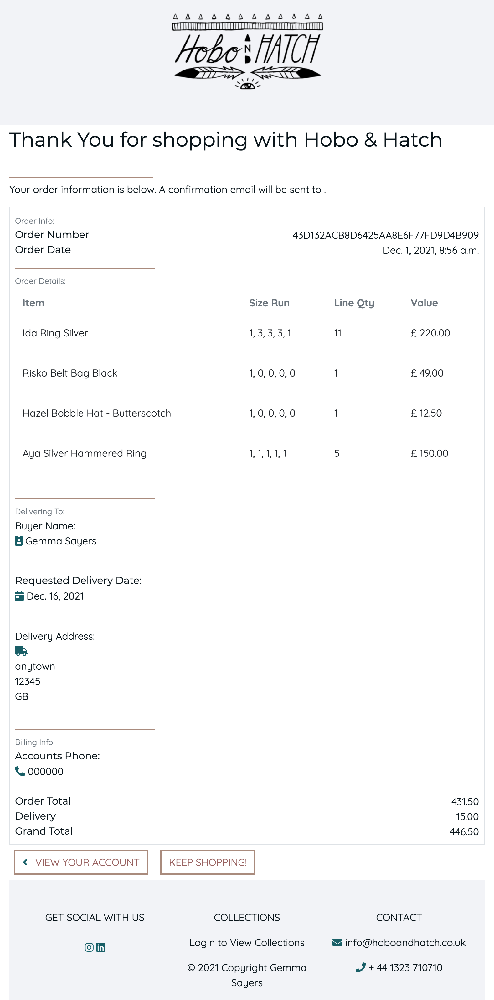

### About Us & Testimonials

* The About us page is accessible to everybody, the testimonials carousel is populated with testimonials from the Testimonials model db, these can be updated over time. 

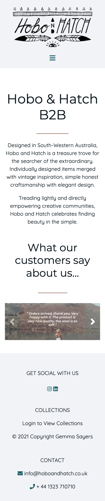

### Messages

* Bootstrap toasts are used as user messages to keep the customer informed during the customer journey.

* At each stage of the user journey, the user receives feedback - for example login success, add to bag, remove from bag, logout, errors.  Some example messages:

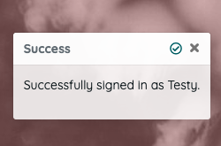

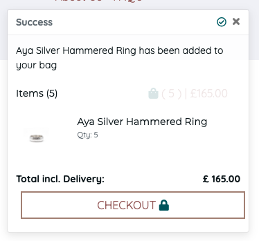

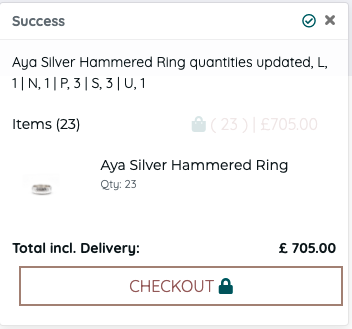

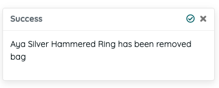

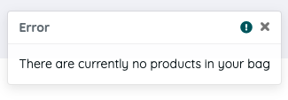

### FAQs

* The FAQ bootstrap accordion is populated by data built on a model of the same name - The store owner / manager can add to the FAQ's in the admin end of the site as and when new ones arise, the more populated this becomes, the more time saves on customer service inquiries.  **Future Feature** would be to make this searchable at a point it becomes necessary

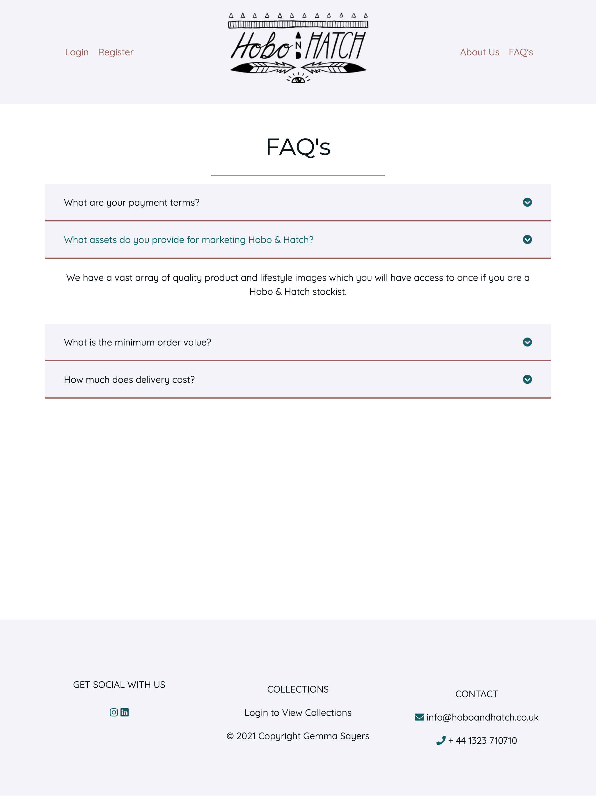

### Forms

* In addition to the crispy-styled Allah Django forms for authentication, there is a Profile creation form which is also updated in the checkout - This is what a user is directed to complete after they have registered - Without it they are not permitted to place an order;

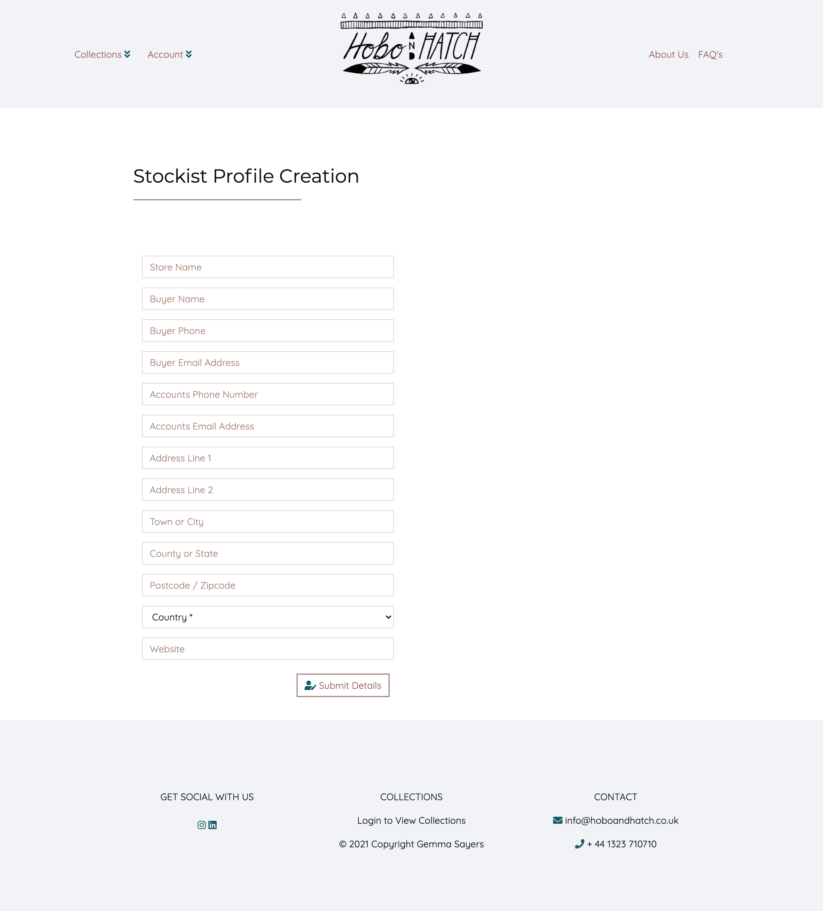

### Footer

* The footer has a responsive design and contains contact info and echos the permitted links for each user:

### Error Pages, Favicon & Manifest

* Simple Error pages have been included alongside a site manifest and a set of falcons to complete the user experience, this has also constables to the 100% Best Practices and SEO scores received across the site.

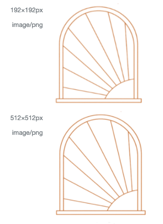

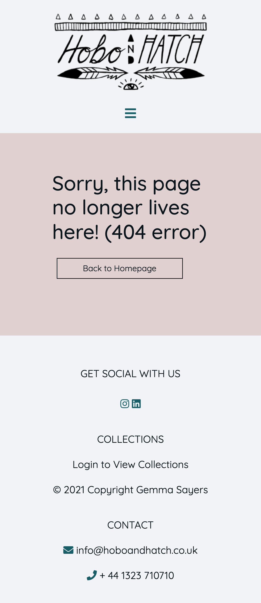

## Future Features

The potential scope for future features is enormous here, here are a few key items that would make great future implementations:

* It would be useful to have stock control so that the client can use the system to house central stocks / the buyer can see available stocks
* Automatic account approval based on the email domain 
* Live tracking of order shipment
* Stockist map on about us page

## Technologies Used
-----

### Languages Used
-----

* [HTML5](https://en.wikipedia.org/wiki/HTML5)
* [CSS3](https://en.wikipedia.org/wiki/Cascading_Style_Sheets)
* [JavaScript](https://www.javascript.com/)
* [Python3](https://www.python.org/)

### Frameworks, Libraries, Programs & Platforms Used
-----

* [Bootstrap 4.6](https://getbootstrap.com/docs/4.6/getting-started/introduction/) is used as a CSS framework to ensure responsive design delivery within the time frame, particular items tilised for features include cards for the products, accordion for the FAQ's, Carousel for the About
* [Lucid.io](https://lucid.co/) is used to create the conceptual designs for the database
* [Django](https://docs.djangoproject.com/en/3.2/topics/auth/default/) is used as the back-end and supports the use of Ninja templates. 
* [Table to Markdown](https://tabletomarkdown.com/convert-spreadsheet-to-markdown/) is used to convert spreadsheets to markdown formatting for the purposes of read me and testing 
* [Balsamiq](https://balsamiq.com/) is used to create the wire frames
* [jQuery](https://jquery.com/) is used mainly to activate elements in the Materialise CSS. 
* [Hover.css](https://ianlunn.github.io/Hover/) I used hover to make elements more interactive.
* [Google Fonts](https://fonts.google.com/) Is used to serve the archive and Montserrat and Quicksand fonts used throughout the project
* [Favicon.io](https://favicon.io/favicon-converter/) Was used to generate falcons for the project.
* [Website Mockup Generator](https://websitemockupgenerator.com/) Was used to generate project mock-ups. 
* [Coolors](https://coolors.co/) was used to generate the colour palette.
* [GitHub](https://github.com/) is used to file the repository and record the version control. 
* [Gitpod](https://gitpod.io) was used for development and version control.
* [Heroku](https://www.heroku.com) is the cloud-based platform used to deploy the project.
* [Google Retools](https://developer.chrome.com/docs/devtools/) Has been used without the project to test, evaluate, edit and assess the project. 
* [W3C Validator](https://validator.w3.org/) To test the validity of the HTML code
* [W3C Jigsaw](https://jigsaw.w3.org/css-validator/) To test the validity of the CSS code
* [JShint](https://jshint.com/) To test the validity of the JS code
* [PEP8 Online](http://pep8online.com/) To test the validity of the JS code

## Deployment

The deployment of a Full Stack e-commerce store using the Django framework takes multiple different considerations since we are also needing to store and serve multiple different images, take payments and store product and order data. 
To serve the project I am using an AWS S3 bucket to store and serve the static files / images, I am using Heroku to host the site and using the Heroku Postures add-on as the database.

## Local Deployment

In order to make a local copy of this project, you can clone it. In your IDE Terminal, type the following command to clone my repository:

- `git clone https://github.com/GJSayers/hobo-hatch-b2b.git`

Alternatively, if using Git pod, you can click below to create your own workspace using this repository.

### Heroku Set-up

* Create a Heroku app on the [Heroku Website](https://id.heroku.com/login) by clicking on the new app button:
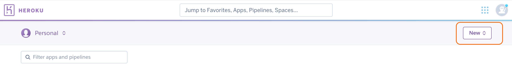
* In the resources tab of the Heroku app, go to the add-ons section and search for postgres. For this app I used the free version 'HobbyDev' : 
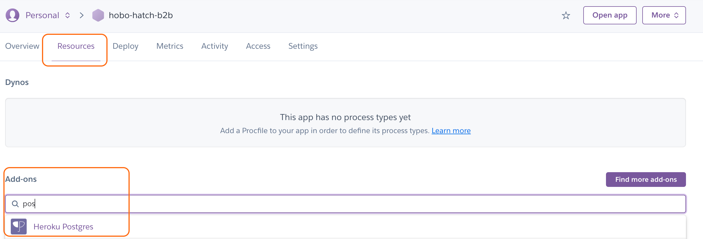
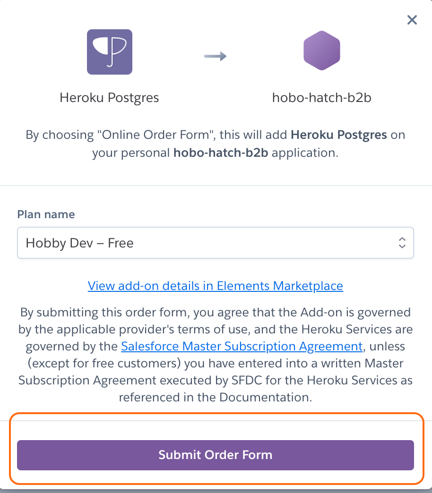

* To enable the use of Postgres, back in Gitpod install `dj_database_url`, and `psycopg2-binary` in the CLI.  The CLI commands are:
* `pip3 install dj_database_url`
* `pip3 install psycopg2-binary`
Then: 
* `pip3 freeze > requirements.txt` 
The pip3 command is to save your installation dependencies. 

* In your settings file, add `import dj_database_url` at the top of the file below the other import instructions. 
* Configure the database in settings file

* Because Postgres is a different database to SQlite3 (which is what is used in the Git environment) it is necessary to make migrations, migrate and re-load the data, in the case of this app using fixtures.  The following commands were used:
* `python3 manage.py make migrations`
* `python3 manage.py migrate` 
* `python3 manage.py loaddata` for each fixture you want to upload ensuring that you consider dependencies between the fixtures. 
* `python3 createsuperuser` to create an admin user and follow the instructions in the Git CLI. 
* Create if statement in settings file to ensure that if we are in Heroku we connect to Postgres, and if not to Sqlite3 
Install gunicorn using:
* `pip3 install gunicorn`

* Create a Profile to enable dynos.
* Since I am hosting images in an S3 bucket on AWS, it is necessary to instruct Heroku not to pick up the static media files from the Git repository by `COLLECT-STATIC` -1 in Heroku config vars.
* Set up secret key in **eny.py** and also in the Heroku environment variables. 
* Set up allowed hosts in **settings.py**
* Ensure that your **env.py** is in your **.gitignore** before pushing changes. 
* Push and merge any changes to **Main branch**, if relevant, then push again.  
* Login to Heroku through the Git CLI and `git push Heroku main` to deploy the first version to Heroku
* In Heroku set up automatic deployments by linking from GitHub - please note on branches that you will need to merge your branch to main in Git if your automatic deploys are set up in Heroku. 
* Check it's working by using the "Open app" button in Heroku.  

### AWS S3 Bucket set-up 
* Head across to [AWS.amazon.com](https://aws.amazon.com/) create an amazon account.
* You will need to add in some payment details, so please be aware that if you go above the free usage limits. 
* Once the account is created or if you already have an account you can sign in.
* In the main dashboard, if you have already used S3 buckets, you will find in 'Recently Used Services', or otherwise you can search for **S3** in the search bar:

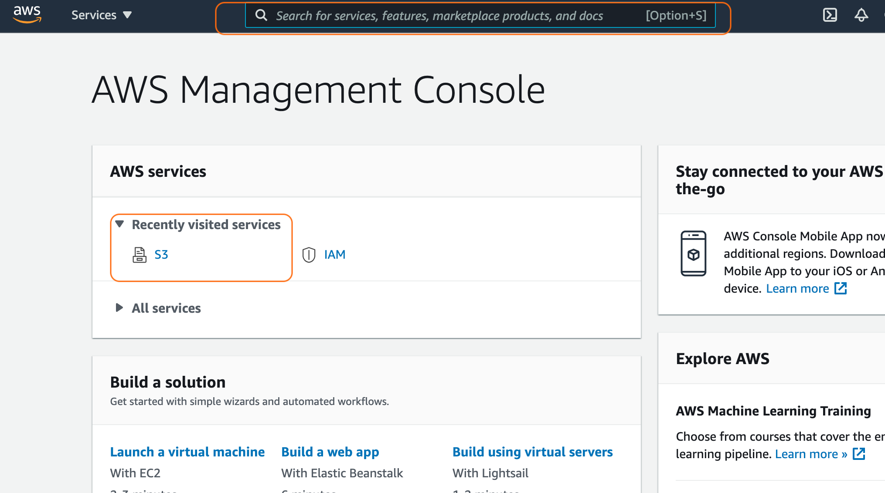

* Once you have clicked to reach S3, you can click on 'Create Bucket' to create your bucket:

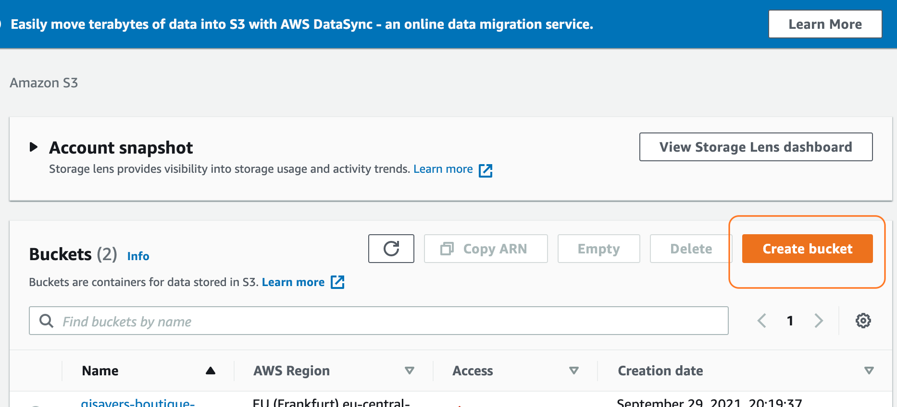

* From here, the best practice is to **give your bucket a matching name to your Heroku app name** 
* For region, **select the region closest to you**. 
* You need to **allow public access** since the images will be public ally viewed - you do this by **unticking the 'block all public access' checkbox**, it will look like this which can be a little daunting, but is correct!:

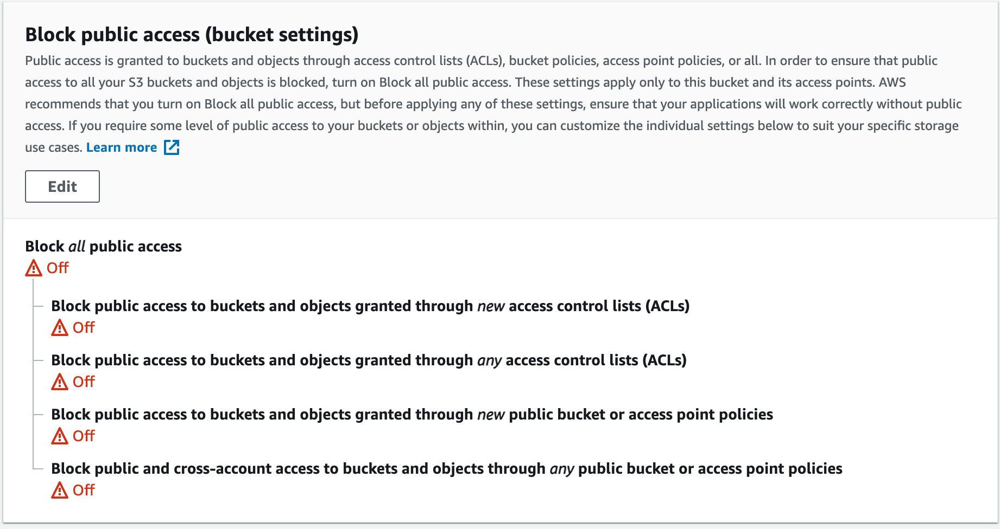

* Then you can click on the 'Create Bucket' as the bottom of the page:

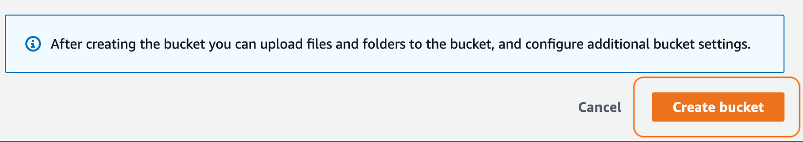

* Once the bucket is created you will be re-directed to your list of buckets.  
* From here further settings need to be put in place. 
* Firstly, you will need to **click on the properties tab**:

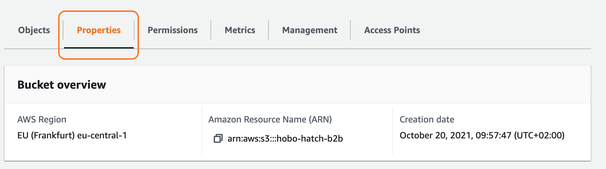

* From here, scroll down to Static website hosting and for Static web hosting choose **Enable**, Hosting type should be **'Host a Static Website'** 

* You will also need to **add default values for index document and error document**.  The settings chosen should resemble the below, then you can click to save changes:

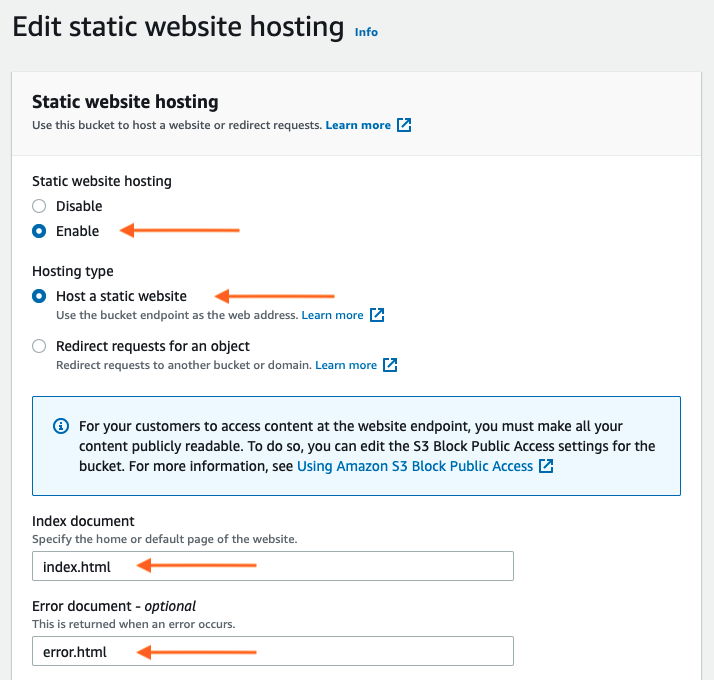

* Next up, select the permissions tab:

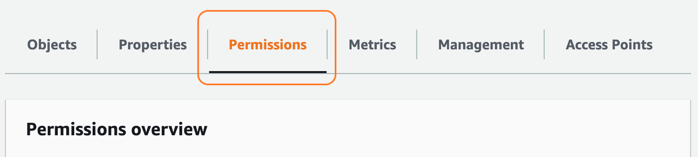

* It is necessary to add a **Cross-origin resource sharing (CORS)** to enable the domains to interact with one another - This CORS JSON format is one I used from the Code Institute lessons, and I pasted it in here like so, then save changes:

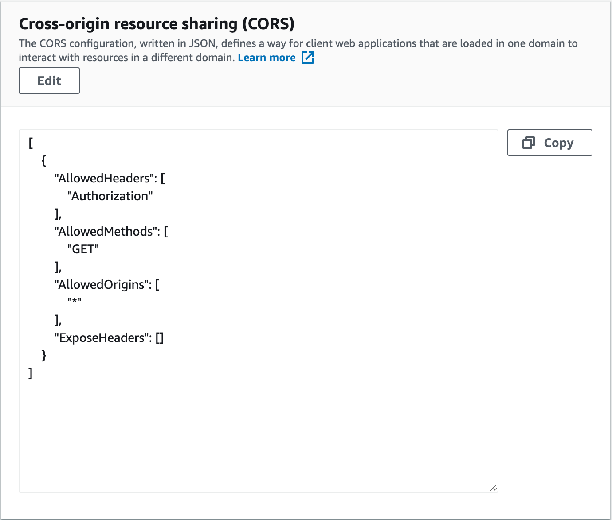

* Still in the permissions tab it is necessary to **create a bucket policy** - handily this can be automatically generated by *clicking on Policy Generator:

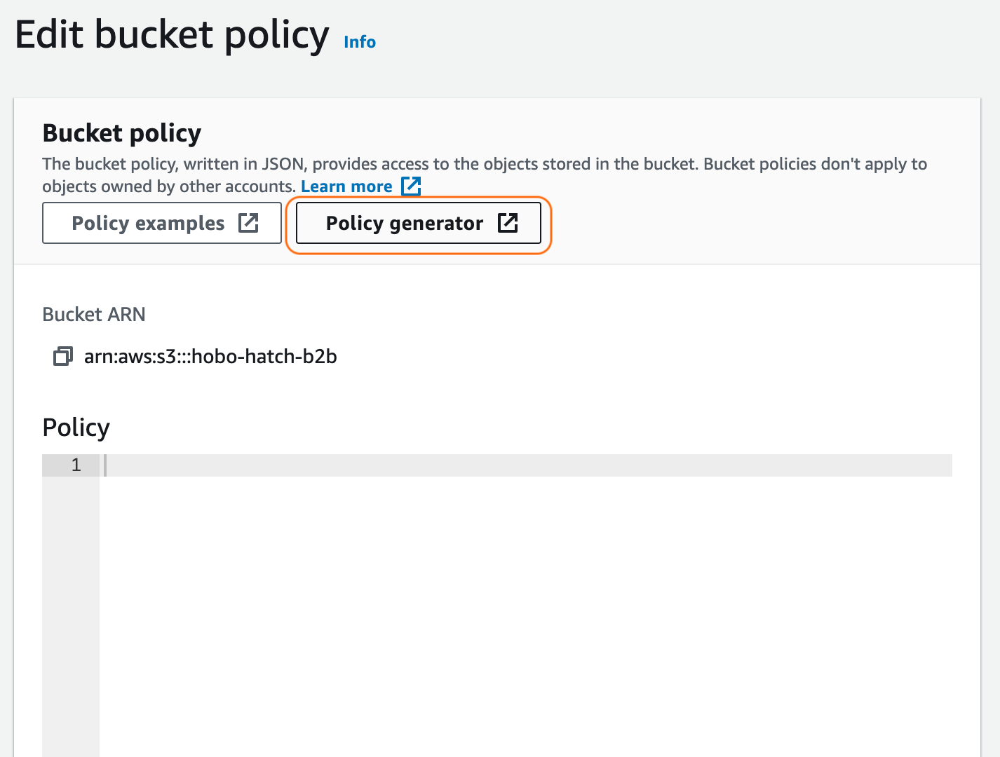

* Once in the generator you need to select the following options:

* Policy type should be **S3 Bucket Policy**
* Effect should be **Allow**
* Principal should be an `*` to allow all
* Actions should be **Get Object**
* Amazon resource name you can find in the **edit bucket policy tab** and paste it in. 
* Finally you can click add statement:

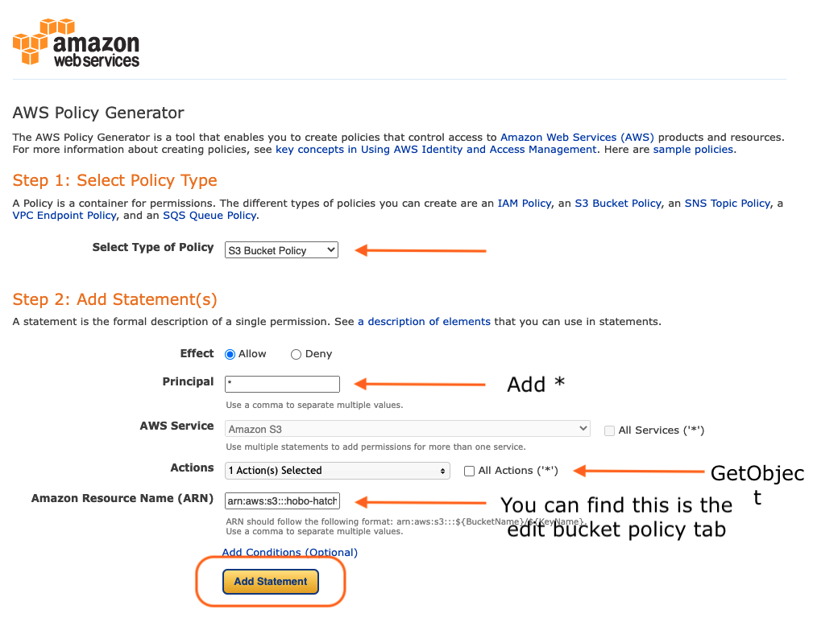

* Then click **Generate Policy**:

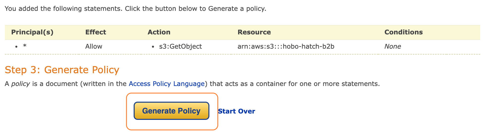

* This will generate a JSON formatted policy that you then copy and paste into the **Bucket Policy** tab. 
* In the "Resource" row, ensure to add "/*" within the quotes at the end - This is to enable access to all resources in the bucket. 
* Then click **save**.
* Still in the permissions tab, **click edit** in the **Access control list (ACL)**
* From here set to **allow public access** and save changes:

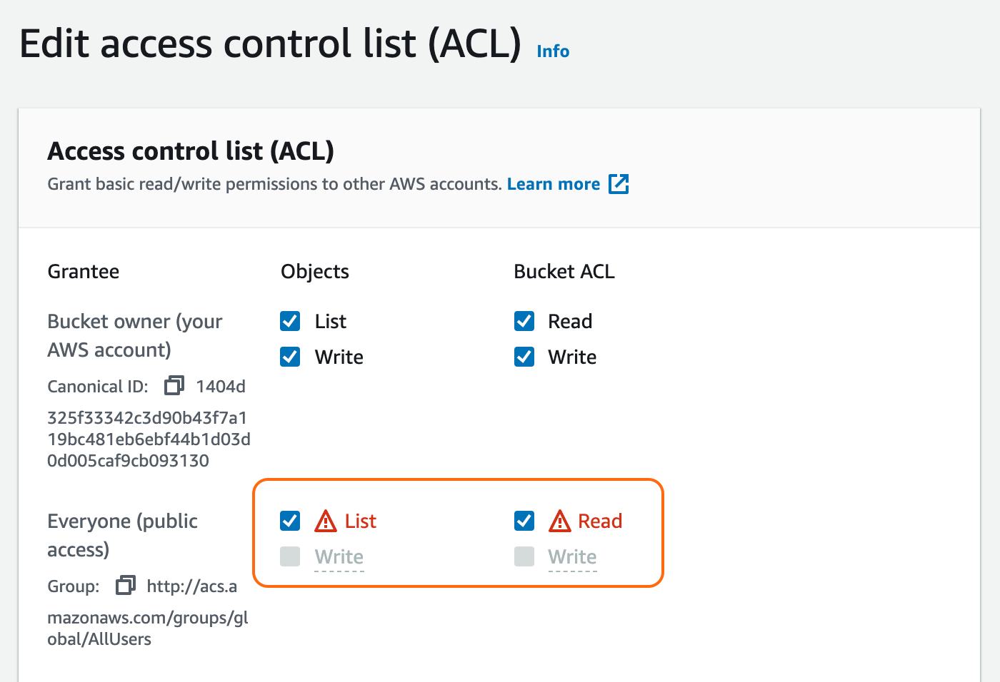

### Creating a user for AWS

To use the S3 Bucket, it is necessary to create a user.  

* Back in the AWS Management Console, either **click on IAM** in your recently visited services or search for the same in the search bar. 

* Create a **user group** for the user by clicking on **User Groups** in the side menu of AWS:

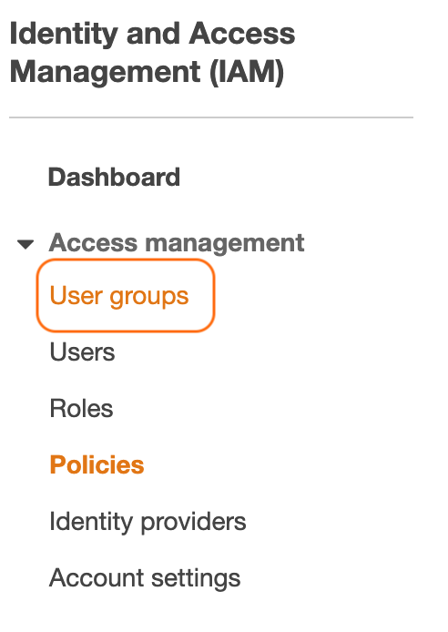

* Then click on **Create Group**:

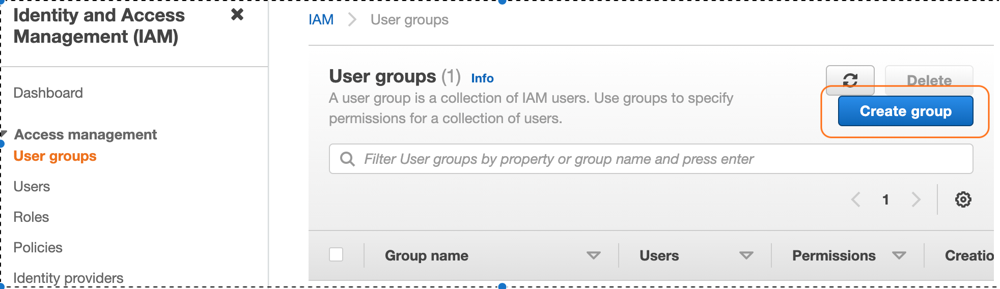

* Give your group a name that is relevant to the project / user
* Click through the following steps to create group (we come back to those later on)
* Create an **access policy** associated with the relevant S3 bucket by choosing **policies** from the side menu bar:

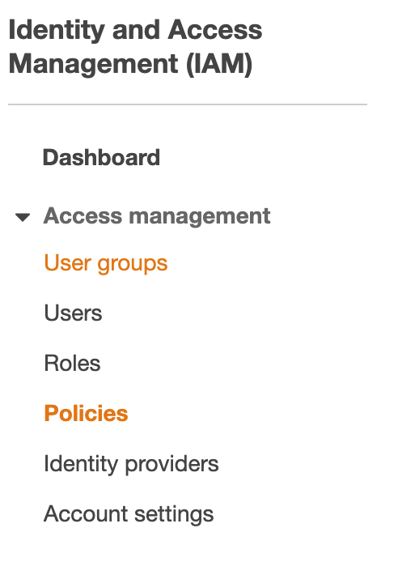

* Then **click create policy button**
* From the Create Policy page click **import managed policy**

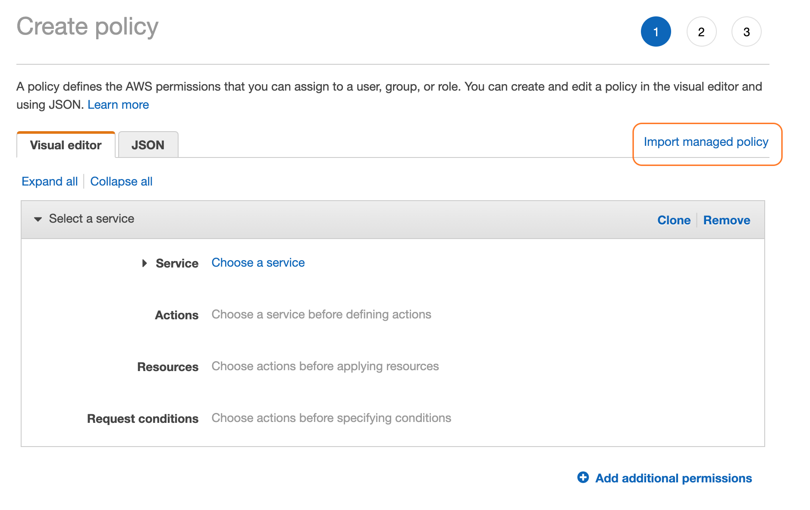

* From the choose policies to import page **search for S3** and select **s3 full access policy** and **click the import button**:

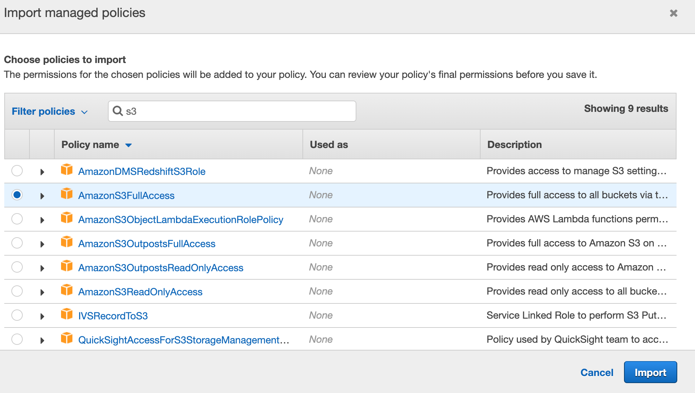

* In the JSON tab, on the resources row, you will need to add again the **ARN number** that you used previously from the bucket policy page to the JSON text - in the format of a list with one line including the ARN number, and one including the ARN number with "/*" at the end. 
* Then you can click **review policy** to add a name and a description. 
* Finally click through to **create policy**
* Then back in **User Groups** click on your newly created group
* Search for the **policy** you created and click **Attach Policy**
* Next **Create a User** to add to the group by navigating to the **Users** page:

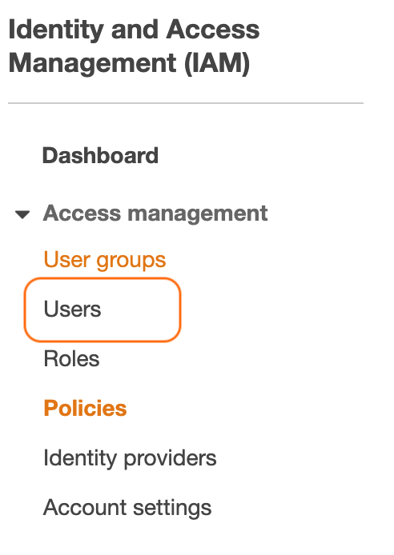

* Click **add user** and give the user a name that makes sense to your project and user access and select the **Programmatic Access** radio button and click **Next** 
* From this page you can tick the appropriate group and click **Next** until the final **Create User** button.  
* A CSV will be created with the user access details - **download this and save it in a safe place** These details can only be downloaded once. 

### Connecting AWS to Django 

* To be able to use crud functionality to create, update and delete static files in AWS through the Django UI it is necessary to install boto3 using the following command:
* `pip3 install boto3`
* I also installed [django-storages](https://django-storages.readthedocs.io/en/latest/) which is a collection of storage back ends for Django, using the command:
* `pip3 install django-storages`
* followed by `pip3 freeze --local > requirements.txt` to ensure the dependencies are installed in deployment.
* next add 'storages' to installed apps in settings.py:

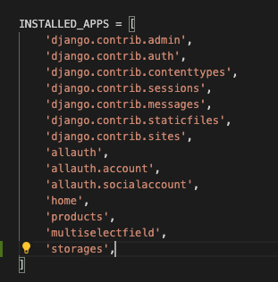

* Define access variables and media storage con fig in the settings.py file being sure to keep any secret keys either in your **env.py** file or in the environment variables on GIT.

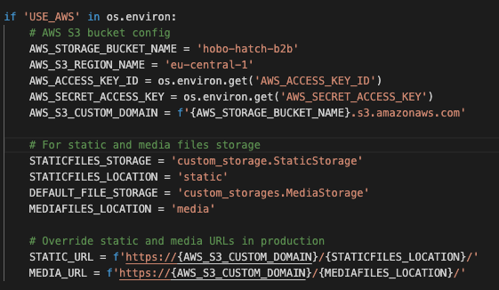
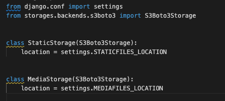

* Set up the same variables in the Heroku con fig vars.
* Create a custom storages file, importing **settings** and **S3Boto3Storage**. With classes inheriting S3Boto3Storage and defining location for static files and media files.

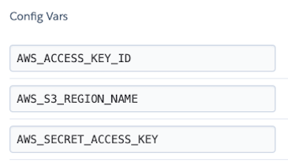

* Remove the Collect Static Con fig var to enable the static files to be collected into the build on the next push.
* If the build has been successful, you should see a similar output to this in the Heroku build log:

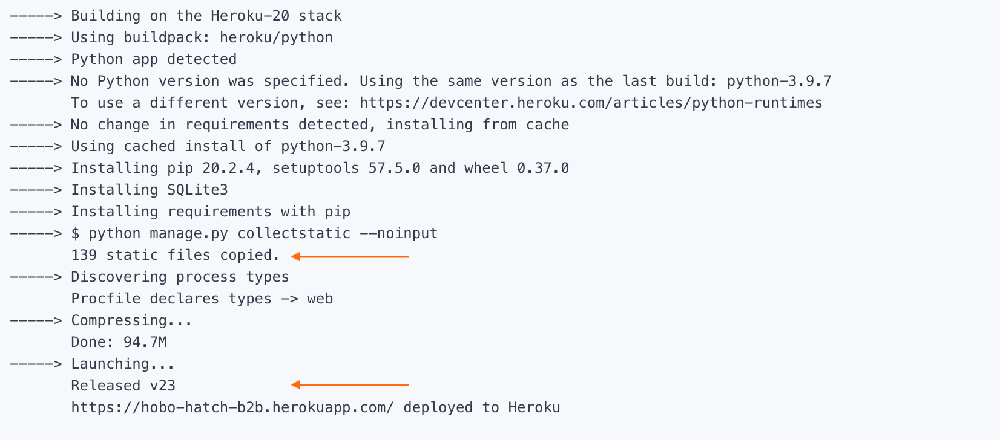

* You should then also be able to see your static folder in your S3 bucket

### DEPLOYMENT ISSUES 

I decided to deploy early so as not to get nasty surprises close to the due date of the project - I came up against a few issues and I thought it would be useful to document these here.

* The first error I encountered on this process was "Django.db.utiles.Terror: value to long for type" upon which I entered the command to see if there were outstanding migrations:
* `python3 manage.py show migrations`

This revealed that indeed there were quite a few migrations that had not applied. 

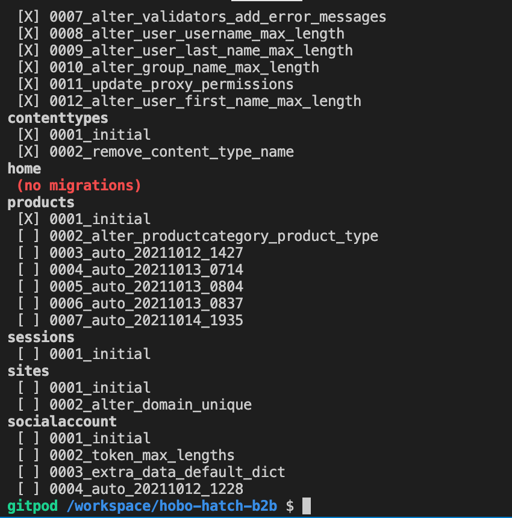

I searched on slack to see if anyone had encountered a similar problem, and discovered that you can skip the offending migration using:
* `python3 manage.py migrate app_name migration_name --fake`

So I decided to try this and the remaining migrations processed. However, another error was thrown:

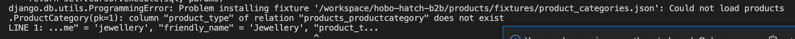

After running through where the process may have gone wrong and with my mentor and finding no obvious methodology errors, we decided to remove the migrations - and with help from tutor support re-install them and re-running all the migrations.

## Testing
-----

Detailed testings has been carried out for functionality, usability and responsiveness which are documented in [TESTING](TESTING.md) with supporting documentation and testing results available in the [testing folder](static/testing) 

## Credits 

### Code

* The project was built following completing the final video-based learning module in the [Code Institute](https://codeinstitute.net) course. There are particular items that have been expanded on from the course project where it made little sense to adapt dramatically, in particular:

* Messages / [toasts](https://getbootstrap.com/docs/5.1/components/toasts/) implementation particularly the bag preview in messages

* JavaSscript for controlling the plus / minus controls at bag and shopping bag (also there was significant trial and error and edits to enable this successfully across the multiple sizes)

* [Stripe](https://stripe.com/docs/stripe-js) implementation

### Content

* The images, logos and descriptions are provided by [Hobo & Hatch](https://www.hoboandhatch.co.uk/), the pricing is edited for business privacy purposes. 

## Acknowledgments

* Thank you to my family and friends for their patience and support whilst I worked on this project 💛

* Thank you to the entire [Code Institute](https://codeinstitute.net/global/) Tutor support team for their knowledge and support on bug solving 🐞 

* Thank you to my mentor [Tim Nelson](https://github.com/TravelTimN) for going above and beyond, sharing useful resources and ideas and being super ororganizednd thorough! 💡 ✅ 🤗
