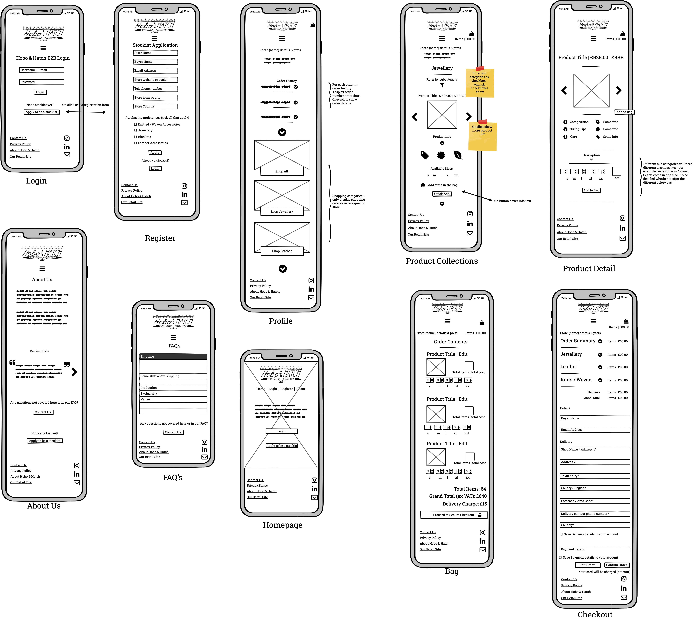
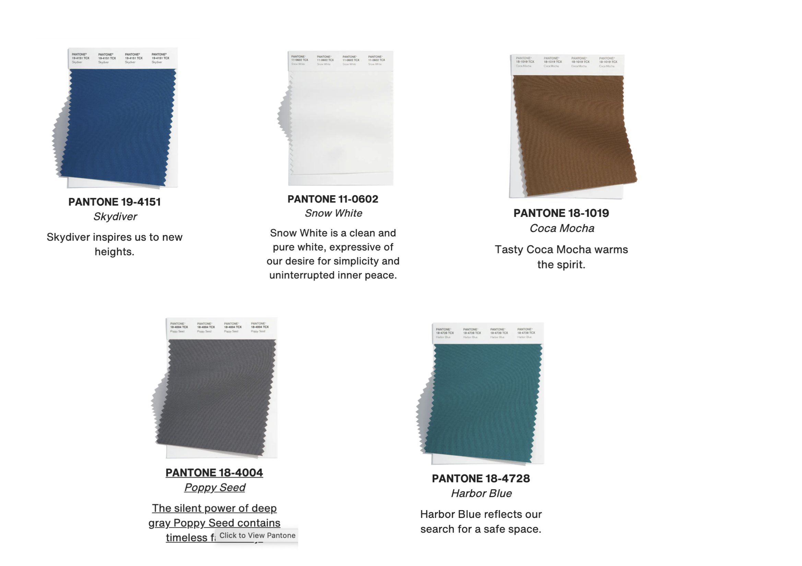

# Hobo & Hatch B2B Ordering Portal

* This ordering portal is created for the fourth and final project on the Full Stack Developer Diploma with Code Institute.  
* The project encompasses the languages and frameworks that I have been using throughout the course, and in particular HTML5, CSS3 & Javascript as frontend tools, using Bootstrap as a frontend framework.  The backend is created with Python, sqlite3 and Django and deployed on Heroku at which point the database used is postgres. 
* The project is based on a real life spec to design a wholesale / B2B ordering portal for retail & wholesale clothing and accessories brand Hobo & Hatch.  The project is delivered at this stage as an MVP, with future features and implementations expected in V2. 

## Strategy
------
* The User stories have been created having discussed in an initial meeting with the brand their requirements for the project.  
* The primary target audience for the brand at a retail / Ecommerce level are women in the 27 to 55 age range with free-spirited values.  They like their own spiritual / bohemian style, and are likely to prefer outdoorsy holidays and hobbies such as surfing and camping and as much travel as possible.  
* This will influence the design in terms of the surface of the website, as even though the website is B2B it is equally important that the brand ethos and look is conveyed to the store buyers. 

## User Stories - Buyer / Stockist
* This group are the primary audience for the site.  Operations need to be simple and effective from browsing through to payment to divert workload from the Brand Owner.  The buyer should be able to easily add styles to the bag, view product details if needed (or not be bombarded with them if they are a repeat purchaser), and edit the bag in a review before proceeding to payment. 

| **US ID** | **User Type**      | **Action**                                               | **Expected Outcome**                                                |
| --------- | ------------------ | -------------------------------------------------------- | ------------------------------------------------------------------- |
|           |                    |                                                          |                                                                     |
| **US 1**  | Buyer / Stockist | View Products                                            | Select items to purchase                                            |
| **US 2**  | Buyer / Stockist | View Products by Category                                | Save time and get to the products I want more easily                |
| **US 3**  | Buyer / Stockist | View Products by Sub Category                            | Further narrow the search for specific purchasing                   |
| **US 4**  | Buyer / Stockist | View Detailed Product info                               | See images, price, description, care info and available sizes       |
| **US 5**  | Buyer / Stockist | See total items and spend in Bag                         | Ensure budget is kept on track                                      |
| **US 6**  | Buyer / Stockist | Select size options easily                               | Easy to order correct items                                         |
| **US 7**  | Buyer / Stockist | Edit or remove items from my bag                         | Easy update of items prior to checkout                              |
| **US 8**  | Buyer / Stockist | Pay securely by card                                     | Checkout securely                                                   |
| **US 9**  | Buyer / Stockist | Use existing Billing / Shipping info or edit at checkout | Ensure the delivery gets to the right place and the card is charged |
| **US 10** | Buyer / Stockist | View more about the brand on an about us page            | Feel confident in the product I am investing in.                    |

## User Stories - Site Owner / Brand Owner
* The Brand / Site owner should have sufficient access to be able to support the client where needed.  They should have full CRUD accessibility and this should not be too technical to access. 

| **US ID** | User Type                | Action                                                 | Expected Outcome                                                                         |
| --------- | ------------------------ | ------------------------------------------------------ | ---------------------------------------------------------------------------------------- |
|           |                          |                                                        |                                                                                          |
| **US 11** | Brand Owner / Site Owner | Create, Read, Update, Delete customer info             | Assist customers with their purchasing & ensure old customer data is not stored too long |
| **US 12** | Brand Owner / Site Owner | Edit customer orders                                   | To change customer order incase of cancelled lines / customer request etc.               |
| **US 13** | Brand Owner / Site Owner | Assign Customer Access Level based on Product Category | Only give purchasing rights to the correct customers                                     |
| **US 14** | Brand Owner / Site Owner | Provide a frequently asked questions page              | To avoid unnecessary inbound customer service emails                                     |
| **US 15** | Brand Owner / Site Owner | Display customer testimonials                          | Encourage new stockists                                                                  |

## User Stories - Site User / First Time User
* As this site is not intended for the general public, the following are intended to cover users that do not know the brannd already or may be trying to log in / register for the first time. 

| **US ID** | User Type | Action                                                    | Expected Outcome                                                    |
| --------- | --------- | --------------------------------------------------------- | ------------------------------------------------------------------- |
|           |           |                                                           |                                                                     |
| **US 16** | Site User | Register for an account                                   | Easily create account                                               |
| **US 17** | Site User | Receive email response to confirm registration request    | Be reassured that your request is being processed                   |
| **US 18** | Site User | Login and Logout                                          | Access shopping, and account info.                                  |
| **US 19** | Site User | Recover Password                                          | Able to easily re-access my account through a link                  |
| **US 20** | Site User | Easily create personalised user profile                   | Be able to view order history and edit account / business details.  |
| **US 21** | Site User | Have a good re-direction experience if not a B2B customer | Be redirected to the E-commerce site and / or social media profiles |

## Scope & Features
------

## Structure
------

### Conceptual Design
* Given that the general premis of the site is centered around B2B ordering, most core features & actions are taken in the logged in status of a B2B stockist.  The below conceptual flowchart is produced on Lucid Chart and gives a visual representation of the key customer journeys whilst using the site. 

### Database Schema
* In the development environment sqlite3 and fixtures will be used to create the relational database.  Then in production to Heroku, postgres will be used. 
* Below you can see the intended database model for this project including anticipated fixtures and forms.  

## Skeleton
------
### Wireframes

* Desktop View

* Mobile View

* Tablet View

## Surface
------
### Design Inspiration & Colour Choices
* Hobo & Hatch HQ is located in Perth, Australia and consequently a lot of their design inspiration comes from the sea, rust-coloured landscape elements and natural tones. 
* Additionally, I wanted to ensure that the colour pallete was in keeping with colour trends, so I took a look at colour trends for 2022 on [Pantone](https://www.pantone.com/articles/fashion-color-trend-report/new-york-fashion-week-spring-summer-2022)
* I found that the following colours were aligned with the colours I was considering that had been inspired by the brand imagery:

* Here are some example images from the brand's lifestyle image collection

* With these inspirations I settled on the following colour scheme produced on [Coolors](https://coolors.co/)

### Typography
* For fonts I will be using Quicksand from [Google Fonts](https://fonts.google.com/?query=quicksand) for the body text as this is an accessibility friendly font, and has a light yet clear effect which is reflective on the brand's values of 'treading lightly'.  
* For titles & headers Montserrat will be used [Google Fonts](https://fonts.google.com/?query=montserrat)
### Imagery
* Imagery used will be source from the brand itself - Hobo & Hatch. 

## Deployment

* Create a Heroku app on the [Heroku Website](https://id.heroku.com/login) by clicking on the new app button:

* In the resources tab of the Heroku app, go to the add-ons section and search for postgress. For this app I used the free version 'HobbyDev' : 

* To enable the use of Postrgres, back in Gitpod install dj_database_url,and psycopg2-binary in the CLI.  The CLI commands are:
* pip3 install dj_database_url
* pip3 install psycopg2-binary
Then: 
* pip3 freeze > requirements.txt 
The pip3 command is to save your installation dependencies. 

* In your settings file, add 'import dj_database_url' at the top of the file below the other import instructions. 
* Configure the database in settings file

* Because Postgres is a different database to SQlite3 (which is what is used in the Git environment) it is necessary to make migrations, migrate and re-load the data, in the case of this app using fixtures.  The following commands were used:
* python3 manage.py makemigrations
* python3 manage.py migrate 
* python3 manage.py loaddata <filename>

* ADD HERE DEPLOYMENT ISSUE * 

* Create if statement in settings file to ensure that if we are in Heroku we connect to Postgres, and if not to Sqlite3 
Install Gunicorn using:
* pip3 install gunicorn

* Create a Procfile 
