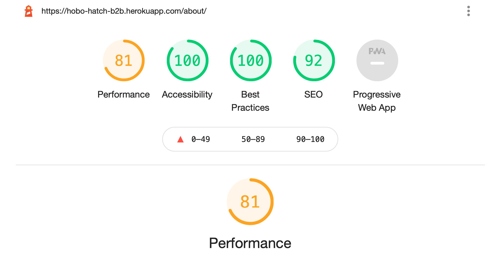

# Hobo & Hatch B2B Ordering Portal - Testing Documentation

## User Story Testing 

* I have gone through and tested each userjourney in relation to the user stories for functionality, usability and responsiveness - below is the final version of the sheet which I have been updating througout the project - Any bugs encountered along the way are documented in the next section covering the Bugs & Fixes:

| **US ID**       | **User Type**                       | **Action**                                                    |                                                                                                                                                                                                                                                | **Expected Outcome**                                                                                                                                                                                                                                                         | **Page / feature**                                                                                             | **Functionality**                  | **Usability**                                                                                                                                                                                                                                                 | **Responsiveness**                                                                                                                              | **Data Management**                                                                                                                                                                                                                                                                 | **CRUD**                   |
| --------------- | ----------------------------------- | ------------------------------------------------------------- | ---------------------------------------------------------------------------------------------------------------------------------------------------------------------------------------------------------------------------------------------- | ---------------------------------------------------------------------------------------------------------------------------------------------------------------------------------------------------------------------------------------------------------------------------- | -------------------------------------------------------------------------------------------------------------- | ---------------------------------- | ------------------------------------------------------------------------------------------------------------------------------------------------------------------------------------------------------------------------------------------------------------- | ----------------------------------------------------------------------------------------------------------------------------------------------- | ----------------------------------------------------------------------------------------------------------------------------------------------------------------------------------------------------------------------------------------------------------------------------------- | -------------------------- |
| **US 1**        | **Shopper / Stockist**              | **View Products**                                             |                                                                                                                                                                                                                                                | **Select items to purchase**                                                                                                                                                                                                                                                 |                                                                                                                | **User story satisfied** ✅         |                                                                                                                                                                                                                                                               |                                                                                                                                                 |                                                                                                                                                                                                                                                                                     | **Product - R** ✅          |
| **Test Case 1** | Testy Tester                          |                                                               |                                                                                                                                                                                                                                                |                                                                                                                                                                                                                                                                              |                                                                                                                |                                    |                                                                                                                                                                                                                                                               |                                                                                                                                                 |                                                                                                                                                                                                                                                                                     |                            |
|                 | Clothing Jewellery                  | View Products                                                 | Log in, navigate to collections                                                                                                                                                                                                                | View only jewellery and clothing products and not view links to other products                                                                                                                                                                                               | /collections & category filtered pages                                                                         | Test Case Satisfied ✅              | The page is easy to access once access is given - there are links in the in the header and footer                                                                                                                                                             | The customer is able to successfully view products across a range of device sizes                                                               | The foreign key of the linking to the category model is what controls visibility                                                                                                                                                                                                    |                            |
| **Test Case 2** | Gemma Sayers                        |                                                               |                                                                                                                                                                                                                                                |                                                                                                                                                                                                                                                                              |                                                                                                                |                                    |                                                                                                                                                                                                                                                               |                                                                                                                                                 |                                                                                                                                                                                                                                                                                     |                            |
|                 | All categories                      | View Products                                                 | Log in, navigate to collections                                                                                                                                                                                                                | View all products and links to all product categories                                                                                                                                                                                                                        | /collections & category filtered pages                                                                         | Test Case Satisfied ✅              | The page is easy to access once access is given - there are links in the in the header and footer                                                                                                                                                             | The customer is able to successfully view products across a range of device sizes                                                               | The foreign key of the linking to the category model is what controls visibility                                                                                                                                                                                                    |                            |
| **US 2**        | **Shopper / Stockist**              | **View Products by Category**                                 |                                                                                                                                                                                                                                                | **Save time and get to the products I want more easily**                                                                                                                                                                                                                     |                                                                                                                | **User story satisfied** ✅         |                                                                                                                                                                                                                                                               |                                                                                                                                                 |                                                                                                                                                                                                                                                                                     | **Product - R** ✅          |
| **Test Case 1** | Testy Tester                          |                                                               |                                                                                                                                                                                                                                                |                                                                                                                                                                                                                                                                              |                                                                                                                |                                    |                                                                                                                                                                                                                                                               |                                                                                                                                                 |                                                                                                                                                                                                                                                                                     |                            |
|                 | Clothing Jewellery                  | View Products by Category                                     | Log in, navigate to collections, filter by category                                                                                                                                                                                            | Filter feature uses checkboxes to filter down to the customer’s preferred categories - Only the allowed categories should appear in the checkbox list                                                                                                                        | /collections & category filtered pages FEAT: Category filter                                                   | Test Case Satisfied ✅              | The filter is a button at the top of the collections page - this opens to checkboxes and the customer is able to filter by only the categories in their permissions list                                                                                      | The functionality works responsively and across a range of device sizes                                                                         | The foreign key of the linking to the category model is what controls visibility                                                                                                                                                                                                    |                            |
| **Test Case 2** | Gemma Sayers                        |                                                               |                                                                                                                                                                                                                                                |                                                                                                                                                                                                                                                                              |                                                                                                                |                                    |                                                                                                                                                                                                                                                               |                                                                                                                                                 |                                                                                                                                                                                                                                                                                     |                            |
|                 | All categories                      | View Products by Category                                     | Log in, navigate to collections, filter by category                                                                                                                                                                                            | Filter feature uses checkboxes to filter down to the customer’s preferred categories - Only the allowed categories should appear in the checkbox list                                                                                                                        | /collections & category filtered pages FEAT: Category filter                                                   | Test Case Satisfied ✅              | The filter is a button at the top of the collections page - this opens to checkboxes and the customer is able to filter by all categories as specified in their permissions list                                                                              | The functionality works responsively and across a range of device sizes                                                                         | The foreign key of the linking to the category model is what controls visibility                                                                                                                                                                                                    |                            |
| **US 3**        | Shopper / Stockist                  | View Products by Sub Category                                 |                                                                                                                                                                                                                                                | Further narrow the search for specific purchasing                                                                                                                                                                                                                            |                                                                                                                |                                    |                                                                                                                                                                                                                                                               |                                                                                                                                                 |                                                                                                                                                                                                                                                                                     |                            |
| **US 4**        | **Shopper / Stockist**              | **View Detailed Product info**                                |                                                                                                                                                                                                                                                | **See images, price, description, care info and available sizes**                                                                                                                                                                                                            |                                                                                                                | **User story satisfied** ✅         |                                                                                                                                                                                                                                                               |                                                                                                                                                 |                                                                                                                                                                                                                                                                                     | **Product - R** ✅          |
| **Test Case 1** | Testy Tester                          |                                                               |                                                                                                                                                                                                                                                |                                                                                                                                                                                                                                                                              |                                                                                                                |                                    |                                                                                                                                                                                                                                                               |                                                                                                                                                 |                                                                                                                                                                                                                                                                                     |                            |
|                 | Clothing Jewellery                  | View Detailed Product info                                    | 1) Log in, navigate to collections, click on a product. 2) try to force navigate to non-permitted product in url                                                                                                                               | See images, price, description, care info and available sizes. Test user should only be able to access permitted products                                                                                                                                                    | /collections/<prodict\_id>.  FEAT:Product details dropdown. FEAT: Multiple size inputs                         | Test Case Satisfied 1) ✅ 2) ✅      | The customer is able to successfully view the product and is unable to manipulate the browser. Dropdown feature works and the add / minus buttons are easy to use                                                                                             | The product page is fully responsive and functional across a range of devices                                                                   |                                                                                                                                                                                                                                                                                     |                            |
| **Test Case 2** | Gemma Sayers                        |                                                               |                                                                                                                                                                                                                                                |                                                                                                                                                                                                                                                                              |                                                                                                                |                                    |                                                                                                                                                                                                                                                               |                                                                                                                                                 |                                                                                                                                                                                                                                                                                     |                            |
|                 | All categories                      | View Detailed Product info                                    | 1) Log in, navigate to collections, click on a product.                                                                                                                                                                                        | See images, price, description, care info and available sizes. User should be able to access all products                                                                                                                                                                    | /collections/<prodict\_id>.  FEAT:Product details dropdown. FEAT: Multiple size inputs                         | Test Case Satisfied 1) ✅           | The customer is able to successfully view the product. Dropdown feature works and the add / minus buttons are easy to use                                                                                                                                     | The product page is fully responsive and functional across a range of devices                                                                   |                                                                                                                                                                                                                                                                                     |                            |
| **US 5**        | **Shopper / Stockist**              | **See total items and spend in Bag**                          |                                                                                                                                                                                                                                                | **Ensure budget is kept on track**                                                                                                                                                                                                                                           |                                                                                                                | **User story satisfied** ✅         |                                                                                                                                                                                                                                                               |                                                                                                                                                 |                                                                                                                                                                                                                                                                                     | **Order - R** ✅            |
| **Test Case 1** | Gemma Sayers                        |                                                               |                                                                                                                                                                                                                                                |                                                                                                                                                                                                                                                                              |                                                                                                                |                                    |                                                                                                                                                                                                                                                               |                                                                                                                                                 |                                                                                                                                                                                                                                                                                     |                            |
|                 | All categories                      | See total items and spend in Bag                              | Log in, navigate to all logged in bags                                                                                                                                                                                                         | When authenticated, the user should be able have easy access to their bag and be able to see a sneak preview of their bag                                                                                                                                                    | All pages, except bag and checkout only when logged in. FEAT:Logged-in-row.  NTH: link from bag message alerts | Test Case Satisfied ✅              | The customer can see the back at the top right of the page once logged in and items in bag.  There is also a back preview in messages once an item is added, providing an option to go directly to checkout                                                   | The bag and message features are visible on a range of devices                                                                                  | The bag data is managed in the bag view, models and contexts.                                                                                                                                                                                                                       |                            |
| **US 6**        | **Shopper / Stockist**              | **Select size options easily**                                |                                                                                                                                                                                                                                                | **Easy to order correct items**                                                                                                                                                                                                                                              |                                                                                                                | **User story satisfied** ✅         |                                                                                                                                                                                                                                                               |                                                                                                                                                 |                                                                                                                                                                                                                                                                                     | **Order - U** ✅            |
| **Test Case 1** | Gemma Sayers                        |                                                               |                                                                                                                                                                                                                                                |                                                                                                                                                                                                                                                                              |                                                                                                                |                                    |                                                                                                                                                                                                                                                               |                                                                                                                                                 |                                                                                                                                                                                                                                                                                     |                            |
|                 | All categories                      | Select size options easily                                    | 1) Log in, navigate to product detail, add different qtys for each size, add to bag. 2) from bag, edit qty’s and click edit 3) from bag remove                                                                                                 | Because the customer is b2b, they do not want a separate entry for each size - customer should be able to add all sizes simultaneously from one product detail page                                                                                                          | /collections/<prodict\_id>.  FEAT: Multiple sizeqty entry                                                      | Test Case Satisfied ✅              | The user is able to successfully manipulate various sizes and submit in one entry from the product page as well as in the bag. The customer can using the edit and update buttons                                                                             | The feature works across a number of devices and works successfully, there is a hover effect on the plus-minus buttons to enable ease of choice |                                                                                                                                                                                                                                                                                     |                            |
| **US 8**        | **Shopper / Stockist**              | **Pay securely by card**                                      |                                                                                                                                                                                                                                                | **Checkout securely**                                                                                                                                                                                                                                                        |                                                                                                                | **User story satisfied** ✅         |                                                                                                                                                                                                                                                               |                                                                                                                                                 |                                                                                                                                                                                                                                                                                     | **Order - C** ✅            |
| **Test Case 1** | Gemma Sayers                        |                                                               |                                                                                                                                                                                                                                                |                                                                                                                                                                                                                                                                              |                                                                                                                |                                    |                                                                                                                                                                                                                                                               |                                                                                                                                                 |                                                                                                                                                                                                                                                                                     |                            |
|                 |                                     | Pay securely by card                                          | Login, add items to back, click ‘checkout and place order                                                                                                                                                                                      | Customer should be able to make a payment using the stripe checkout - A successful payment will result in a checkout success message, an order in the admin and a payment showing in stripe.                                                                                 | /checkout                                                                                                      | Test Case Satisfied ✅              | Successful checkout has been registered in both the admin console and in stripe. The customer also receives an email from the company email address with an order summary                                                                                     | The feature works across a number of devices and works successfully.                                                                            |                                                                                                                                                                                                                                                                                     |                            |
| **US 9**        | **Shopper / Stockist**              | **Use existing Billing / Shipping info or edit at checkout**  |                                                                                                                                                                                                                                                | **Ensure the delivery gets to the right place and the card is charged**                                                                                                                                                                                                      |                                                                                                                | **User story satisfied** ✅         |                                                                                                                                                                                                                                                               |                                                                                                                                                 |                                                                                                                                                                                                                                                                                     | **Profile - U** ✅          |
| **Test Case 1** | Gemma Sayers                        |                                                               |                                                                                                                                                                                                                                                |                                                                                                                                                                                                                                                                              |                                                                                                                |                                    |                                                                                                                                                                                                                                                               |                                                                                                                                                 |                                                                                                                                                                                                                                                                                     |                            |
|                 |                                     | Use existing Billing / Shipping info or edit at checkout      | Login, go to profile, update profile. Navigate to collections, click on a product, add items to back, click ‘checkout and place order                                                                                                          | The customer should not have to fill in all of their data each time a purchase is made unless they want to change the data. Any delivery or billing data that the customer or manager has already entered to the customer profile should be pre-filled in the checkout form. | /checkout                                                                                                      | Test Case Satisfied ✅              | The form gets populated with existing data from the customer profile, the customer also has the options                                                                                                                                                       | The form is responsive across device testing and uses crispy forms for a clean display                                                          |                                                                                                                                                                                                                                                                                     |                            |
|                 |                                     |                                                               |                                                                                                                                                                                                                                                |                                                                                                                                                                                                                                                                              |                                                                                                                |                                    |                                                                                                                                                                                                                                                               |                                                                                                                                                 |                                                                                                                                                                                                                                                                                     |                            |
| **US 11**       | **Brand Owner / Site Owner**        | **Create, Read, Update, Delete customer info**                |                                                                                                                                                                                                                                                | **Assist customers with their purchasing & ensure old customer data is not stored too long**                                                                                                                                                                                 |                                                                                                                | **User story satisfied** ✅         |                                                                                                                                                                                                                                                               |                                                                                                                                                 |                                                                                                                                                                                                                                                                                     | **Profile - C, R, U, D** ✅ |
| **Test Case 1** | SuperUser2                          | Create, Read, Update, Delete customer info                    | 1) login to admin as superuser, navigate to profiles, change details, save. 2) Login to admin, navigate to add user, create user, navigate to profiles, add profile details, save.  3) Login to admin, navigate to profiles, delete a customer | Customers should be Able to be created, viewed, edited and deleted.                                                                                                                                                                                                          |                                                                                                                | Test Case Satisfied 1) ✅ 2) ✅ 3) ✅ | Add dropdown in superuser login                                                                                                                                                                                                                               |                                                                                                                                                 |                                                                                                                                                                                                                                                                                     |                            |
| **US 12**       | **Brand Owner / Site Owner**        | **Edit customer orders**                                      |                                                                                                                                                                                                                                                | **To change customer order incase of cancelled lines / customer request etc.**                                                                                                                                                                                               |                                                                                                                | **User story satisfied** ✅         |                                                                                                                                                                                                                                                               |                                                                                                                                                 |                                                                                                                                                                                                                                                                                     | **Order - U, D** ✅         |
|                 | SuperUser2                          |                                                               | 1) login to admin as superuser, navigate to orders, change details, save.  2) Login to admin, navigate to orders, delete an order                                                                                                              |                                                                                                                                                                                                                                                                              |                                                                                                                | Test Case Satisfied 1) ✅ 2) ✅      | Orders are easy to edit from the orders page, and the facility to update different size ranges within the admin has been facilitated                                                                                                                          |                                                                                                                                                 |                                                                                                                                                                                                                                                                                     |                            |
| **US 13**       | **Brand Owner / Site Owner**        | **Assign Customer Access Level based on Product Category**    |                                                                                                                                                                                                                                                | **Only give purchasing rights to the correct customers**                                                                                                                                                                                                                     |                                                                                                                | **User story satisfied** ✅         |                                                                                                                                                                                                                                                               |                                                                                                                                                 |                                                                                                                                                                                                                                                                                     | **Profile - U** ✅          |
|                 | SuperUser2                          |                                                               | 1) login to admin as superuser, navigate to profiles, edit category, save. 2) login as edited user, check that visible categories are updated in accordance with the admin changes                                                             |                                                                                                                                                                                                                                                                              |                                                                                                                | Test Case Satisfied 1) ✅ 2) ✅      | The admin user is able to easily edit the customer data in the admin using checkboxes for the permissions categories                                                                                                                                          |                                                                                                                                                 | Data is kept tidy, as these preferences are managed by the admin user - once decided these categories can only be edited by the admin user. This enables good data analysis and brand management - ensuring a store does not hold up sales to other customers on a certain category |                            |
| **US 14**       | **Brand Owner / Site Owner**        | **Provide a frequently asked questions page**                 |                                                                                                                                                                                                                                                | **To avoid unnecessary inbound customer service emails**                                                                                                                                                                                                                     |                                                                                                                | **User story satisfied** ✅         |                                                                                                                                                                                                                                                               |                                                                                                                                                 |                                                                                                                                                                                                                                                                                     | **Brand - R** ✅            |
|                 | General user - not logged           |                                                               | Navigate to FAQ’s and check visibility                                                                                                                                                                                                         | An FAQ’s accordion should be visible and clickable                                                                                                                                                                                                                           |                                                                                                                | Test Case Satisfied ✅              | A very simple to use dropdown accordion                                                                                                                                                                                                                       | Works well across all devices tested                                                                                                            | FAQ data can be populated in the backend as and when new questions arise and will automatically populate through to the frontend thanks for the FAQ’s models and views                                                                                                              |                            |
| **US 15**       | **Brand Owner / Site Owner**        | **Display customer testimonials**                             |                                                                                                                                                                                                                                                | **Encourage new stockists**                                                                                                                                                                                                                                                  |                                                                                                                | **User story satisfied** ✅         |                                                                                                                                                                                                                                                               |                                                                                                                                                 |                                                                                                                                                                                                                                                                                     | **Brand - R** ✅            |
|                 | General user - not logged           |                                                               | Navigate to about us page and check visibility                                                                                                                                                                                                 | Should see a carousel of quotes under the about us general info                                                                                                                                                                                                              |                                                                                                                | Test Case Satisfied ✅              | A carousel of background images are overplayed with testimonials text on the about us page. The descision was made not to add a testimonials form at this stage due to the brand wanting to control the content. There is potential for a future feature here | Works well across all devices tested                                                                                                            | Testimonial data can be populated in the backend as and when new testimonials are given and will automatically populate through to the frontend thanks for the FAQ’s models and views -                                                                                             |                            |
| **US 16**       | **Site User**                       | **Register for an account**                                   |                                                                                                                                                                                                                                                | **Easily create account**                                                                                                                                                                                                                                                    |                                                                                                                | **User story satisfied** ✅         |                                                                                                                                                                                                                                                               |                                                                                                                                                 |                                                                                                                                                                                                                                                                                     | **User - C** ✅             |
|                 | New Customer / not existing profile |                                                               | Navigate to and submit registration form                                                                                                                                                                                                       | Receive message & email on registration                                                                                                                                                                                                                                      | /register                                                                                                      |                                    |                                                                                                                                                                                                                                                               |                                                                                                                                                 |                                                                                                                                                                                                                                                                                     |                            |
|                 |                                     |                                                               | Test navigation from all ‘register’ links                                                                                                                                                                                                      | All links should lead to registration                                                                                                                                                                                                                                        | /register & associated links to get there                                                                      |                                    |                                                                                                                                                                                                                                                               |                                                                                                                                                 |                                                                                                                                                                                                                                                                                     |                            |
|                 |                                     |                                                               |                                                                                                                                                                                                                                                |                                                                                                                                                                                                                                                                              |                                                                                                                |                                    |                                                                                                                                                                                                                                                               |                                                                                                                                                 |                                                                                                                                                                                                                                                                                     |                            |
| **US 17**       | **Site User**                       | **Receive email response to confirm registration request**    |                                                                                                                                                                                                                                                | **Be reassured that your request is being processed**                                                                                                                                                                                                                        | In user email                                                                                                  | **User story satisfied** ✅         |                                                                                                                                                                                                                                                               |                                                                                                                                                 |                                                                                                                                                                                                                                                                                     |                            |
| **US 18**       | **Site User**                       | **Login and Logout**                                          |                                                                                                                                                                                                                                                | **Access shopping, and account info.**                                                                                                                                                                                                                                       |                                                                                                                | **User story satisfied** ✅         |                                                                                                                                                                                                                                                               |                                                                                                                                                 |                                                                                                                                                                                                                                                                                     |                            |
| **US 19**       | **Site User**                       | **Recover Password**                                          |                                                                                                                                                                                                                                                | **Able to easily re-access my account through a link**                                                                                                                                                                                                                       | In user email                                                                                                  |                                    |                                                                                                                                                                                                                                                               |                                                                                                                                                 |                                                                                                                                                                                                                                                                                     | **Profile - U** ✅          |
| **US 20**       | **Site User**                       | **Easily create personalised user profile**                   |                                                                                                                                                                                                                                                | **Be able to view order history and edit account / business details.**                                                                                                                                                                                                       | /profile<customerid>                                                                                           | **User story satisfied** ✅         |                                                                                                                                                                                                                                                               |                                                                                                                                                 |                                                                                                                                                                                                                                                                                     | **Profile - C** ✅          |
| **US 21**       | **Site User**                       | **Have a good re-direction experience if not a B2B customer** |                                                                                                                                                                                                                                                | **Be redirected to the E-commerce site and / or social media profiles**                                                                                                                                                                                                      | /home                                                                                                          | **User story satisfied** ✅         |                                                                                                                                                                                                                                                               |                                                                                                                                                 |                                                                                                                                                                                                                                                                                     |                            |

## Feature Testing

### Homepage

* For the Homepage of Hobo & Hatch B2B it was essential for the potential or existing customer to get a sense of the brand on first site and a simple to navigate set of call to actions base on whether the customer is a new user, a registered user or completed profile user. 

### Navigation
 
* For the Navigation, due to the level of permissions required for a B2B Site it is also necessary to ensure that the links to not lead to any non-permitted pages

### Profile & Authentication Process for a B2B site

* A B2B site operates a little differently from a standard authentication site, in that purchases can only happen once the Profile is set-up not only by the user having registered, but also approved by admin.  This is due to the B2B business needing to ensure that they have all relevent details needed for business supply and analysis.  This means that there is a three step process involved:
 1) Customer registers as a user 
 2) Customer is redirected to fill in a more detailed profile form and submits this(and receives a message in the window to let them know their account application will be reviewed)
 3) Admin user selects the relevant Category permissions in the backend & contacts the customer to alert them that they can now begin to place orders. From this point the profile user has access to their assigned/ permitted categories and this is reflected across the site

### Profile Page

* 

### Collections

* 

### Filtering 

* From the collections page the products can be filtered by one or more Categories using the checkbox filter feature - This is a permissions-based feature linking back to the assigned categories

### Product Detail

* The products detail also uses cards, and included a detailed description of the product as well as multiple size inputs & product info dropdown 

#### **Product Info Feature**

* To display the product info without the option to hide it makes for a busy page, so I decided that a dropdown functionality was necessary so that buyers can access the product details at a glance - This feature is operational on both the Product detail and collections pages.  The data for the infosections is populated by the data held in the Product Model, and an icon is added depending on which info item is relevant

#### **Multiple Sizing Entry**

* Since B2B customers have to consider the size ratio as a whole, it was necessary to be able to add multiple sizes in one product submission  - This took a great deal of trial and error to perfect, but the result has great UX!  The code for this is also  fairly easily scalable, so there is potential to add different options in the future should the brand require

### Multiple Sizing Entry in Admin

* In order to successfully edit an order / lineitem in the admin it was necessary to apply a similar logic to the sizing inputs - An admin user can easily update all different types of products and their size breakdowns in the admin

### Bag

* The bag contains a great deal of information due to the multiple sizes per item and the potential multiple items a professional buyer would be adding to the bag - It took quite a lot of refactoring to get to the final version of the bag, which is fully responsive and with the option to edit the sizes or remive the items. 

### Checkout with Stripe

* The checkout provided is using the Stripe API with styling from crispy-forms.  The user has an easy to use form and can update their profile details on checkout should they choose to do so

* The checkout success fires an email to the given email address and returns a summary of the order placed. 

### About Us & Testimonials

* The About us page is accessible to everybody, the testimonials carousel is populated with testimonials from the Testimonials model db, these can be updated over time. 

### Messages

* Bootstrap toasts are used as user messages to keep the customer informed during the customer journey - There are various messages for bag, 
### FAQ's
### Footer

## Bugs & Fixes

I have kept a track of the various bug details and solutions that were encountered in the project by raising issues in the Bugs & Fixes column of the project board - Where relevant below, the solutions are linked to. 

* BUG: Product detail page not showing product properties dropdown. Issue [#8](https://github.com/GJSayers/hobo-hatch-b2b/issues/8) | [board](https://github.com/GJSayers/hobo-hatch-b2b/projects/1#card-73742593)

* BUG: Checkout success not displaying sizeitem breakdown Issue [#9](https://github.com/GJSayers/hobo-hatch-b2b/issues/9) | [board](https://github.com/GJSayers/hobo-hatch-b2b/projects/1#card-73636239)

* BUG: Checkout and Admin, unable to display individual sizes. Issue [#6](https://github.com/GJSayers/hobo-hatch-b2b/issues/6) | [board](https://github.com/GJSayers/hobo-hatch-b2b/projects/1#card-73636055)

* BUG: Input boxes are not displaying the numeric content due to size crunching on smaller devices. Issue [#3](https://github.com/GJSayers/hobo-hatch-b2b/issues/3) | [board](https://github.com/GJSayers/hobo-hatch-b2b/projects/1#card-72361530)

* BUG: When adding products to the bag, the first product does not add correctly to the bag, the first product goes in as an empty dictionary, then following entries add correctly. Issue [#2](https://github.com/GJSayers/hobo-hatch-b2b/issues/2) | [board](https://github.com/GJSayers/hobo-hatch-b2b/projects/1#card-72361114)

* BUG: Checkout Issue with saving the database - Problem in Orders & Profiles Models #4 - Issue [#4](https://github.com/GJSayers/hobo-hatch-b2b/issues/4) | [board](https://github.com/GJSayers/hobo-hatch-b2b/projects/1#card-70915631)

* BUG: Filtering checkbox choices - Not showing despite logic in place: Issue [#10](https://github.com/GJSayers/hobo-hatch-b2b/issues/10) | [board](https://github.com/GJSayers/hobo-hatch-b2b/projects/1#card-73826858)

### Testing Tools & Results 

* The following tools were used to test the validity of the code on the site.  

* [W3C Validator](https://validator.w3.org/) Was used to test the validity of the HTML code - The first round resulted in minimal errors, all of which were corrects in the final round of testing.  
* Round 1 of testing can be viewed in [this folder](docs/code_testing/round_1)
* Final round pass screenshots can be viewed in [this folder](docs/code_testing/final)
* [W3C Jigsaw](https://jigsaw.w3.org/css-validator/) To test the validity of the CSS code
* [JShint](https://jshint.com/)  was used to test the validity of the JS code, all code passed, there were some comments regarding items that are only available in ES6 and also the tool did not recognise the $ in the jquery, however there were no actual warnings once the code was complete, only these info points. 
* [PEP8 Online](http://pep8online.com/) Was used to test the validity of the Python code, all code resulted in a pass, with the exception of the authorisation passwords in the Settings file on lines 118, 121, 124, 127 which cannot be split.  The testing screenshots can be viewed in [this folder](docs/code_testing/final/pep8)

### Browser Testing